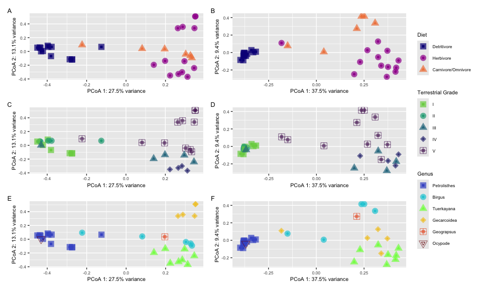
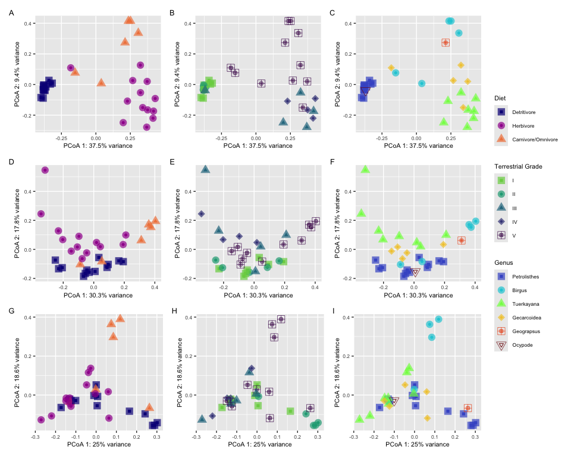
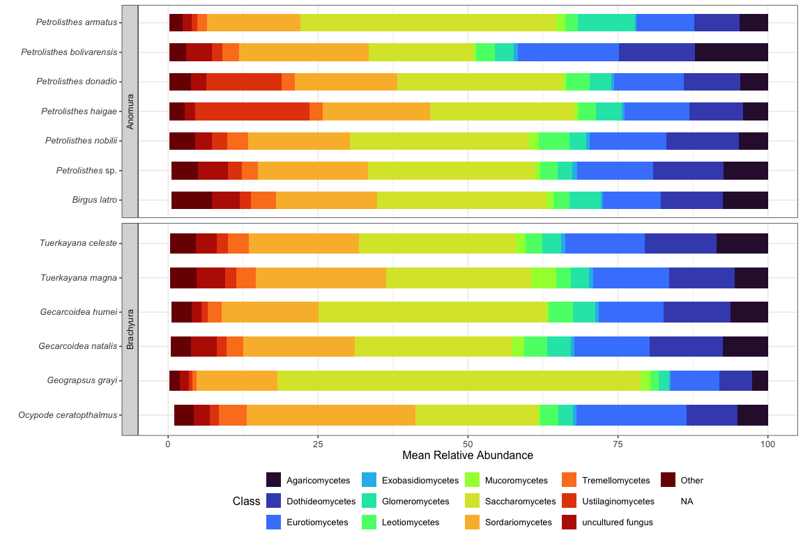
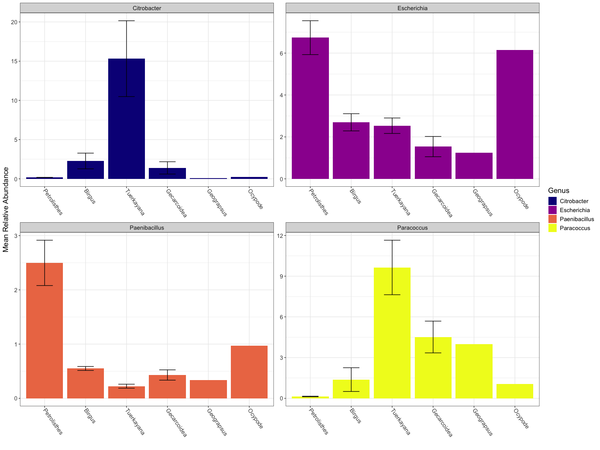

Land Crab Gut Microbiomes
================
Cassie Ettinger
2023-08-30

Project: Unlocking the terrestrial realm: Are microbial symbioses the
key to land crab terrestrial invasions? Collaborators: Cassie Ettinger,
Victoria Watson-Zink, Laetitia Wilkins

What role does the gut microbiome of land crabs play in their ability to
digest recalcitrant plant matter? To address this question, this project
(1) characterizes the microbial community inhabiting the gut tissues of
land crabs from lineages that have invaded terrestrial habitats; (2)
asess whether there is an evolutionary or phylogenetic context to these
microbial associations; and (3) compare the putative functions of gut
microbiomes in marine and terrestrial crabs.

ChatGPT 3.5 (<https://openai.com>) was asked to suggest improvements to
code comments. These suggestions were edited and incorporated as
appropriate to help streamline documentation for readability.

### Load in required libraries

``` r
# Load required R packages
library(tidyverse)
library(phyloseq)
library(vroom)
library(microbiome)
library(patchwork)
library(vegan)
library(pairwiseAdonis)
library(ggtext)
library(decontam)
library(FSA)

# Load custom R script with miscellaneous functions
source(file = "scripts/R_scripts/misc_functions.R")
```

### Import metagenomic coverage information from coverM and prepare for analysis

``` r
# Load metadata from 'metadata_crabs.csv' and convert it to
# a sample_data object
metadata <- vroom("data/metadata_crabs.csv")
```

    ## Rows: 33 Columns: 25
    ## ── Column specification ────────────────────────────────────────────────────────
    ## Delimiter: ","
    ## chr (22): Species, FilePrefix, Samples used, Collector, ShortID, Individual,...
    ## dbl  (2): Year, DNA Concentration
    ## lgl  (1): SRA Assession
    ## 
    ## ℹ Use `spec()` to retrieve the full column specification for this data.
    ## ℹ Specify the column types or set `show_col_types = FALSE` to quiet this message.

``` r
meta <- sample_data(metadata)
rownames(meta) <- meta$FilePrefix

# Load coverM data and preprocess it to split into RPKM
# metric
coverm_mag <- vroom("data/MAGs/coverm/coverm_results_mincov0_aln75_id95.tsv") %>%
    pivot_longer(cols = -c(1), names_to = "Sample") %>%
    pivot_wider(names_from = Genome, values_from = value) %>%
    separate(Sample, into = c("Sample", "Abundance"), sep = " ",
        extra = "merge") %>%
    mutate(Sample = gsub("_L002_R1_001.fastq.gz.reads.filtered_1.fastq.gz",
        "", Sample))
```

    ## Rows: 130 Columns: 67
    ## ── Column specification ────────────────────────────────────────────────────────
    ## Delimiter: "\t"
    ## chr  (1): Genome
    ## dbl (66): 119_S24_L002_R1_001.fastq.gz.reads.filtered_1.fastq.gz Relative Ab...
    ## 
    ## ℹ Use `spec()` to retrieve the full column specification for this data.
    ## ℹ Specify the column types or set `show_col_types = FALSE` to quiet this message.

``` r
# Filter the coverM data to include only RPKM
rpkm_mag <- coverm_mag %>%
    filter(Abundance == "RPKM")

# Prepare coverM data into otu_table format for phyloseq
otu_coverM <- as.data.frame(rpkm_mag[-c(2:3)])
row.names(otu_coverM) <- otu_coverM$Sample
otu_coverM <- otu_coverM[-c(1)]
otu_coverM_table <- otu_table(otu_coverM, taxa_are_rows = FALSE)

# Load MAG taxonomy data and clean up taxonomy names
gtdbtk <- vroom("data/MAGs/CVL_final_bin_set_20230516.csv") %>%
    separate("classification", into = c("domain", "phylum", "class",
        "order", "family", "genus", "species"), sep = ";") %>%
    mutate(species = gsub(".__", "", species), genus = gsub(".__",
        "", genus), family = gsub(".__", "", family), order = gsub(".__",
        "", order), class = gsub(".__", "", class), phylum = gsub(".__",
        "", phylum), domain = gsub(".__", "", domain)) %>%
    mutate(across(where(is.character), ~na_if(., ""))) %>%
    mutate(species = ifelse(is.na(species), (ifelse(is.na(genus),
        ifelse(is.na(family), ifelse(is.na(order), ifelse(is.na(class),
            ifelse(is.na(phylum), as.character(superkingdom),
                as.character(phylum)), as.character(class)),
            as.character(order)), as.character(family)), as.character(genus))),
        as.character(species))) %>%
    mutate(genus = ifelse(is.na(genus), ifelse(is.na(family),
        ifelse(is.na(order), ifelse(is.na(class), ifelse(is.na(phylum),
            as.character(superkingdom), as.character(phylum)),
            as.character(class)), as.character(order)), as.character(family)),
        as.character(genus))) %>%
    mutate(family = ifelse(is.na(family), ifelse(is.na(order),
        ifelse(is.na(class), ifelse(is.na(phylum), as.character(superkingdom),
            as.character(phylum)), as.character(class)), as.character(order)),
        as.character(family))) %>%
    mutate(order = ifelse(is.na(order), ifelse(is.na(class),
        ifelse(is.na(phylum), as.character(superkingdom), as.character(phylum)),
        as.character(class)), as.character(order))) %>%
    mutate(class = ifelse(is.na(class), ifelse(is.na(phylum),
        as.character(superkingdom), as.character(phylum)), as.character(class))) %>%
    mutate(phylum = ifelse(is.na(phylum), as.character(superkingdom),
        as.character(phylum)))
```

    ## Rows: 217 Columns: 29
    ## ── Column specification ────────────────────────────────────────────────────────
    ## Delimiter: ","
    ## chr (21): bin_name, group, total_coding_sequences, classification, fastani_r...
    ## dbl  (8): completeness, contamination, coding_density, contig_N50, average_g...
    ## 
    ## ℹ Use `spec()` to retrieve the full column specification for this data.
    ## ℹ Specify the column types or set `show_col_types = FALSE` to quiet this message.

``` r
# Prepare MAG taxonomy data into tax_table format for
# phyloseq
tax.mag <- as.data.frame(gtdbtk[c(1, 11:17)])
row.names(tax.mag) <- tax.mag$bin_name
tax.mag <- tax.mag[-c(1)]
tax_table_mag <- tax_table(as.matrix(tax.mag))

# Create a phyloseq object with the coverM data and its
# taxonomy
physeq_coverM <- phyloseq(otu_coverM_table, tax_table_mag, meta)

physeq_coverM
```

    ## phyloseq-class experiment-level object
    ## otu_table()   OTU Table:         [ 114 taxa and 33 samples ]
    ## sample_data() Sample Data:       [ 33 samples by 25 sample variables ]
    ## tax_table()   Taxonomy Table:    [ 114 taxa by 7 taxonomic ranks ]

### Import kraken2/braken read-based information and prepare for analysis

``` r
# Prior to R need to obtain the full taxonomy string for
# each taxid output by kraken and bind to our data

# cut -f2 species_bracken.tsv | tail -n +2 | ete3 ncbiquery
# --info > species_taxonomy.txt
# /opt/miniconda3/envs/ete3/lib/python3.6/site-packages/ete3-3.1.2-py3.7.egg/ete3/ncbi_taxonomy/ncbiquery.py:243:
# UserWarning: taxid 2715211 was translated into 2758038
# /opt/miniconda3/envs/ete3/lib/python3.6/site-packages/ete3-3.1.2-py3.7.egg/ete3/ncbi_taxonomy/ncbiquery.py:243:
# UserWarning: taxid 2918672 was translated into 2917790

# cut -f2 genus_bracken.tsv | tail -n +2 | ete3 ncbiquery
# --info > genus_taxonomy.txt cut -f2 family_bracken.tsv |
# tail -n +2 | ete3 ncbiquery --info > family_taxonomy.txt
# cut -f2 phylum_bracken.tsv | tail -n +2 | ete3 ncbiquery
# --info > phylum_taxonomy.txt

# Import taxonomy data from NCBI/ete3
tax2name <- vroom("data/braken_results/species_taxonomy.txt")
```

    ## Rows: 17862 Columns: 5
    ## ── Column specification ────────────────────────────────────────────────────────
    ## Delimiter: "\t"
    ## chr (3): Sci.Name, Rank, Named Lineage
    ## dbl (1): Taxid
    ## num (1): Taxid Lineage
    ## 
    ## ℹ Use `spec()` to retrieve the full column specification for this data.
    ## ℹ Specify the column types or set `show_col_types = FALSE` to quiet this message.

``` r
# Clean up taxonomy levels that contain incorrect strings
tax2name <- tax2name %>%
    mutate_at("Named Lineage", str_replace, "Bacteroidetes/Chlorobi group,",
        "") %>%
    mutate_at("Named Lineage", str_replace, "Terrabacteria group,",
        "") %>%
    mutate_at("Named Lineage", str_replace, "delta/epsilon subdivisions,",
        "") %>%
    mutate_at("Named Lineage", str_replace, "Cystobacterineae,",
        "") %>%
    mutate_at("Named Lineage", str_replace, "Sorangiineae,",
        "") %>%
    mutate_at("Named Lineage", str_replace, "Roseiflexineae,",
        "") %>%
    mutate_at("Named Lineage", str_replace, "Nannocystineae,",
        "") %>%
    mutate_at("Named Lineage", str_replace, "PVC group,", "") %>%
    mutate_at("Named Lineage", str_replace, "FCB group,", "") %>%
    mutate_at("Named Lineage", str_replace, "Cyanobacteria/Melainabacteria group,",
        "") %>%
    mutate_at("Named Lineage", str_replace, "Klebsiella/Raoultella group,",
        "") %>%
    mutate_at("Named Lineage", str_replace, "Chromobacterium group,",
        "") %>%
    mutate_at("Named Lineage", str_replace, "Erythrobacter/Porphyrobacter group,",
        "") %>%
    mutate_at("Named Lineage", str_replace, "Massilia group,",
        "") %>%
    mutate_at("Named Lineage", str_replace, "Sinorhizobium/Ensifer group,",
        "") %>%
    mutate_at("Named Lineage", str_replace, "Brucella/Ochrobactrum group,",
        "") %>%
    mutate_at("Named Lineage", str_replace, "Rhizobium/Agrobacterium group,",
        "") %>%
    mutate_at("Named Lineage", str_replace, "Azotobacter group,",
        "") %>%
    mutate_at("Named Lineage", str_replace, "Alteromonas/Salinimonas group,",
        "") %>%
    mutate_at("Named Lineage", str_replace, "Chryseobacterium group,",
        "") %>%
    mutate_at("Named Lineage", str_replace, "Chlamydia/Chlamydophila group,",
        "") %>%
    mutate_at("Named Lineage", str_replace, "CUG-Ser1 clade,",
        "") %>%
    mutate_at("Named Lineage", str_replace, "Candida/Lodderomyces clade,",
        "") %>%
    mutate_at("Named Lineage", str_replace, "Agaricomycetes incertae sedis,",
        "") %>%
    mutate_at("Named Lineage", str_replace, "saccharomyceta,",
        "") %>%
    mutate_at("Named Lineage", str_replace, "leotiomyceta,",
        "") %>%
    mutate_at("Named Lineage", str_replace, "Agaricomycetidae,",
        "") %>%
    mutate_at("Named Lineage", str_replace, "CUG-Ser2 clade,",
        "") %>%
    mutate_at("Named Lineage", str_replace, "dothideomyceta,",
        "") %>%
    mutate_at("Named Lineage", str_replace, "Pleosporomycetidae,",
        "") %>%
    mutate_at("Named Lineage", str_replace, "sordariomyceta,",
        "") %>%
    mutate_at("Named Lineage", str_replace, "Hypocreomycetidae,",
        "") %>%
    mutate_at("Named Lineage", str_replace, "Acarosporomycetidae,",
        "") %>%
    mutate_at("Named Lineage", str_replace, "Chaetothyriomycetidae,",
        "") %>%
    mutate_at("Named Lineage", str_replace, "Dothideomycetidae,",
        "") %>%
    mutate_at("Named Lineage", str_replace, "Eurotiomycetidae,",
        "") %>%
    mutate_at("Named Lineage", str_replace, "Mycocaliciomycetidae,",
        "") %>%
    mutate_at("Named Lineage", str_replace, "Phallomycetidae,",
        "") %>%
    mutate_at("Named Lineage", str_replace, "Pleosporomycetidae incertae sedis,",
        "") %>%
    mutate_at("Named Lineage", str_replace, "Sordariomycetidae,",
        "") %>%
    mutate_at("Named Lineage", str_replace, "Xylariomycetidae,",
        "") %>%
    mutate_at("Named Lineage", str_replace, "Phallomycetidae,",
        "") %>%
    mutate_at("Named Lineage", str_replace, "Dothideomycetes incertae sedis,",
        "Dothideomycetes incertae sedis,Dothideomycetes incertae sedis,") %>%
    mutate_at("Named Lineage", str_replace, "Apansporoblastina,",
        "Apansporoblastina,Apansporoblastina,Apansporoblastina,") %>%
    mutate_at("Named Lineage", str_replace, "Microsporidia incertae sedis,",
        "Microsporidia incertae sedis,Microsporidia incertae sedis,Microsporidia incertae sedis,Microsporidia incertae sedis,") %>%
    mutate_at("Named Lineage", str_replace, "Tubulinosematoidea,",
        "Tubulinosematoidea,Tubulinosematoidea,Tubulinosematoidea,") %>%
    mutate_at("Named Lineage", str_replace, "Pleosporineae,",
        "") %>%
    mutate_at("Named Lineage", str_replace, "Taphrinomycotina incertae sedis,",
        "Taphrinomycotina incertae sedis,Taphrinomycotina incertae sedis, Taphrinomycotina incertae sedis,") %>%
    mutate_at("Named Lineage", str_replace, "Mucorineae,", "") %>%
    mutate_at("Named Lineage", str_replace, "Fungiina,", "") %>%
    mutate_at("Named Lineage", str_replace, "Suillineae,", "") %>%
    mutate_at("Named Lineage", str_replace, "Pansporoblastina,",
        "Pansporoblastina,Pansporoblastina,Pansporoblastina,") %>%
    mutate_at("Named Lineage", str_replace, "TACK group,", "") %>%
    mutate_at("Named Lineage", str_replace, "Stenosarchaea group,",
        "") %>%
    mutate_at("Named Lineage", str_replace, "Methanomada group,",
        "") %>%
    mutate_at("Named Lineage", str_replace, "DPANN group,", "")


# Split the 'Named Lineage' column into separate taxonomic
# levels
tax2name.split <- tax2name %>%
    separate("Named Lineage", into = c("root", "domain", "superkingdom",
        "phylum", "class", "order", "family", "genus", "species"),
        sep = ",")
```

    ## Warning: Expected 9 pieces. Additional pieces discarded in 11164 rows [22, 44, 49, 72,
    ## 84, 90, 92, 94, 95, 97, 98, 99, 101, 102, 103, 108, 112, 116, 117, 121, ...].

    ## Warning: Expected 9 pieces. Missing pieces filled with `NA` in 1050 rows [391, 392, 393,
    ## 394, 395, 396, 397, 398, 399, 400, 768, 778, 786, 789, 790, 852, 874, 888,
    ## 1718, 1719, ...].

``` r
# Handle taxonomy data for fungi which has longer lineages
tax2name.split.fungi <- tax2name %>%
    separate("Named Lineage", into = c("root", "domain", "superkingdom",
        "clade", "kingdom", "subkingdom", "phylum", "subphylum",
        "class", "order", "family", "genus", "species"), sep = ",")
```

    ## Warning: Expected 13 pieces. Additional pieces discarded in 5324 rows [861, 913, 914,
    ## 915, 916, 917, 918, 919, 920, 921, 922, 923, 924, 925, 926, 927, 928, 929, 930,
    ## 931, ...].

    ## Warning: Expected 13 pieces. Missing pieces filled with `NA` in 11796 rows [1, 2, 3, 4,
    ## 5, 6, 7, 8, 9, 10, 11, 12, 13, 14, 15, 16, 17, 18, 19, 20, ...].

``` r
# Import braken counts data
otu_kraken <- vroom("data/braken_results/species_bracken.tsv")
```

    ## Rows: 17864 Columns: 69
    ## ── Column specification ────────────────────────────────────────────────────────
    ## Delimiter: "\t"
    ## chr  (2): name, taxonomy_lvl
    ## dbl (67): taxonomy_id, 119_S24.S.bracken_num, 119_S24.S.bracken_frac, 120_S2...
    ## 
    ## ℹ Use `spec()` to retrieve the full column specification for this data.
    ## ℹ Specify the column types or set `show_col_types = FALSE` to quiet this message.

``` r
# Extract the taxonomy information from the 'otu_kraken'
# dataframe
tax <- as.data.frame(otu_kraken[1:2])

# Remove unnecessary columns from the 'otu_kraken'
# dataframe
otu_kraken <- otu_kraken[-c(2, 3, seq(5, length(otu_kraken),
    2))]

# Clean up taxonomy IDs
tax <- tax %>%
    mutate(taxonomy_id = ifelse(taxonomy_id == "2715211", as.double("2758038"),
        as.double(taxonomy_id))) %>%
    mutate(taxonomy_id = ifelse(taxonomy_id == "2918672", as.double("2917790"),
        as.double(taxonomy_id)))

# Join the taxonomy information for bacteria/archaea
tax2 <- left_join(tax, tax2name.split, by = c(taxonomy_id = "Taxid"))

# Remove unnecessary columns
tax2 <- tax2[-c(3, 4, 14)]
rownames(tax2) <- paste0("Species", 1:nrow(tax2))

# Clean up missing taxonomic levels
tax2 <- tax2 %>%
    mutate(genus = ifelse(is.na(genus), ifelse(is.na(family),
        ifelse(is.na(order), ifelse(is.na(class), ifelse(is.na(phylum),
            as.character(superkingdom), as.character(phylum)),
            as.character(class)), as.character(order)), as.character(family)),
        as.character(genus))) %>%
    mutate(family = ifelse(is.na(family), ifelse(is.na(order),
        ifelse(is.na(class), ifelse(is.na(phylum), as.character(superkingdom),
            as.character(phylum)), as.character(class)), as.character(order)),
        as.character(family))) %>%
    mutate(order = ifelse(is.na(order), ifelse(is.na(class),
        ifelse(is.na(phylum), as.character(superkingdom), as.character(phylum)),
        as.character(class)), as.character(order))) %>%
    mutate(class = ifelse(is.na(class), ifelse(is.na(phylum),
        as.character(superkingdom), as.character(phylum)), as.character(class))) %>%
    mutate(phylum = ifelse(is.na(phylum), as.character(superkingdom),
        as.character(phylum)))

tax3 <- tax2[-c(1:3)]

# Join the taxonomy information for fungi
tax2_fungi <- left_join(tax, tax2name.split.fungi, by = c(taxonomy_id = "Taxid"))

# Remove unnecessary columns
tax2_fungi <- tax2_fungi[-c(3, 4, 5, 6, 7, 8, 10, 12, 18)]
rownames(tax2_fungi) <- paste0("Species", 1:nrow(tax2_fungi))

# Clean up missing taxonomic levels
tax2_fungi <- tax2_fungi %>%
    mutate(genus = ifelse(is.na(genus), ifelse(is.na(family),
        ifelse(is.na(order), ifelse(is.na(class), ifelse(is.na(phylum),
            as.character(kingdom), as.character(phylum)), as.character(class)),
            as.character(order)), as.character(family)), as.character(genus))) %>%
    mutate(family = ifelse(is.na(family), ifelse(is.na(order),
        ifelse(is.na(class), ifelse(is.na(phylum), as.character(kingdom),
            as.character(phylum)), as.character(class)), as.character(order)),
        as.character(family))) %>%
    mutate(order = ifelse(is.na(order), ifelse(is.na(class),
        ifelse(is.na(phylum), as.character(kingdom), as.character(phylum)),
        as.character(class)), as.character(order))) %>%
    mutate(class = ifelse(is.na(class), ifelse(is.na(phylum),
        as.character(kingdom), as.character(phylum)), as.character(class))) %>%
    mutate(phylum = ifelse(is.na(phylum), as.character(kingdom),
        as.character(phylum)))

tax3_fungi <- tax2_fungi[-c(1:2)]


# Convert for phyloseq
otu_kraken <- as.data.frame(otu_kraken)
rownames(otu_kraken) <- paste0("Species", 1:nrow(otu_kraken))
otu_kraken <- otu_kraken[-c(1)]
otu_kraken_table <- otu_table(otu_kraken, taxa_are_rows = TRUE)

# Create taxonomy objects for bacteria/archaea and fungi
tax_table_kraken <- tax_table(as.matrix(tax3))
tax_table_kraken_fungi <- tax_table(as.matrix(tax3_fungi))

# Load metadata
metadata <- vroom("data/metadata_crabs.csv")
```

    ## Rows: 33 Columns: 25
    ## ── Column specification ────────────────────────────────────────────────────────
    ## Delimiter: ","
    ## chr (22): Species, FilePrefix, Samples used, Collector, ShortID, Individual,...
    ## dbl  (2): Year, DNA Concentration
    ## lgl  (1): SRA Assession
    ## 
    ## ℹ Use `spec()` to retrieve the full column specification for this data.
    ## ℹ Specify the column types or set `show_col_types = FALSE` to quiet this message.

``` r
metadata_fix <- metadata %>%
    mutate(FilePrefix = ifelse(FilePrefix == "BLB_WG4_S19", "BLB_WG4",
        ifelse(FilePrefix == "BLR_WG4_S20", "BLR_WG4", as.character(FilePrefix))))
meta <- sample_data(metadata_fix)
rownames(meta) <- paste0(meta$FilePrefix, ".S.bracken_num")

# Create phyloseq objects for bacteria/archaea and fungi
physeq_krak <- phyloseq(otu_kraken_table, tax_table_kraken, meta)
physeq_krak_fungitax <- phyloseq(otu_kraken_table, tax_table_kraken_fungi,
    meta)


physeq_krak
```

    ## phyloseq-class experiment-level object
    ## otu_table()   OTU Table:         [ 17864 taxa and 33 samples ]
    ## sample_data() Sample Data:       [ 33 samples by 25 sample variables ]
    ## tax_table()   Taxonomy Table:    [ 17864 taxa by 8 taxonomic ranks ]

``` r
physeq_krak_fungitax
```

    ## phyloseq-class experiment-level object
    ## otu_table()   OTU Table:         [ 17864 taxa and 33 samples ]
    ## sample_data() Sample Data:       [ 33 samples by 25 sample variables ]
    ## tax_table()   Taxonomy Table:    [ 17864 taxa by 7 taxonomic ranks ]

``` r
# Summarize RPKM (Reads Per Kilobase Million) for each
# sample
sampleSums(physeq_coverM)
```

    ## Warning: 'sampleSums' is deprecated.
    ## Use 'sample_sums' instead.
    ## See help("Deprecated") and help("phyloseq-deprecated").

    ##     119_S24     120_S25     140_S26     147_S27     177_S28     178_S29 
    ##    219.7987    222.7186    333.2244    336.8622    408.4051    334.0135 
    ##     179_S31     209_S30     214_S32      82_S21      88_S22      99_S23 
    ##    388.1135    318.2556    250.8248    369.1185    425.7150    224.2144 
    ##     BLB_S18 BLB_WG4_S19     BLR_S17 BLR_WG4_S20     BLS_S16     DC06_S1 
    ##    325.3878    295.4405    271.3701    379.0918    388.3350    254.5436 
    ##     DC10_S2     DC11_S3     DC17_S4     DM13_S9    DM14_S10    DM15_S11 
    ##    258.5429    290.9622    188.6931    187.8589    216.3922    232.2536 
    ##    DM16_S12    GG01_S14    GH01_S13     GN13_S5     GN15_S6     GN18_S7 
    ##    187.5729    364.0987    335.1444    352.6146    358.9962    387.0543 
    ##     GN19_S8     NEG_S33    OC01_S15 
    ##    362.4991    350.0541    284.0852

``` r
# Calculate Kracken2/Braken counts per sample
sampleSums(physeq_krak)
```

    ## Warning: 'sampleSums' is deprecated.
    ## Use 'sample_sums' instead.
    ## See help("Deprecated") and help("phyloseq-deprecated").

    ##  119_S24.S.bracken_num  120_S25.S.bracken_num  140_S26.S.bracken_num 
    ##                6368839                6668671                9846553 
    ##  147_S27.S.bracken_num  177_S28.S.bracken_num  178_S29.S.bracken_num 
    ##               10966891               11077730               10023228 
    ##  179_S31.S.bracken_num  209_S30.S.bracken_num  214_S32.S.bracken_num 
    ##                9374284                9945023                8576067 
    ##   82_S21.S.bracken_num   88_S22.S.bracken_num   99_S23.S.bracken_num 
    ##                9254770               10255385                5433626 
    ##  BLB_S18.S.bracken_num  BLB_WG4.S.bracken_num  BLR_S17.S.bracken_num 
    ##                9003102                9658503                5838930 
    ##  BLR_WG4.S.bracken_num  BLS_S16.S.bracken_num  DC06_S1.S.bracken_num 
    ##                9788515               10804055               11545060 
    ##  DC10_S2.S.bracken_num  DC11_S3.S.bracken_num  DC17_S4.S.bracken_num 
    ##               11179234               12422993               10604363 
    ##  DM13_S9.S.bracken_num DM14_S10.S.bracken_num DM15_S11.S.bracken_num 
    ##                5496167                9643701                8531863 
    ## DM16_S12.S.bracken_num GG01_S14.S.bracken_num GH01_S13.S.bracken_num 
    ##                9385641                6994340               11898581 
    ##  GN13_S5.S.bracken_num  GN15_S6.S.bracken_num  GN18_S7.S.bracken_num 
    ##                7421694               10146189               10984819 
    ##  GN19_S8.S.bracken_num  NEG_S33.S.bracken_num OC01_S15.S.bracken_num 
    ##                9363479                     91                7519304

``` r
# Subset set to only bacteria
physeq_krak_bac <- subset_taxa(physeq_krak, superkingdom == "Bacteria")

# Subset set to only archaea
physeq_krak_arc <- subset_taxa(physeq_krak, superkingdom == "Archaea")

# Subset set to only fungi
physeq_krak_fun <- subset_taxa(physeq_krak_fungitax, kingdom ==
    "Fungi")

# Calculate remaining counts per sample after subsetting
# for each of the three groups
sampleSums(physeq_krak_bac)
```

    ## Warning: 'sampleSums' is deprecated.
    ## Use 'sample_sums' instead.
    ## See help("Deprecated") and help("phyloseq-deprecated").

    ##  119_S24.S.bracken_num  120_S25.S.bracken_num  140_S26.S.bracken_num 
    ##                 170493                 167349                 298826 
    ##  147_S27.S.bracken_num  177_S28.S.bracken_num  178_S29.S.bracken_num 
    ##                 363245                 490100                 512495 
    ##  179_S31.S.bracken_num  209_S30.S.bracken_num  214_S32.S.bracken_num 
    ##                 312155                 330810                 456799 
    ##   82_S21.S.bracken_num   88_S22.S.bracken_num   99_S23.S.bracken_num 
    ##                 275469                 285999                 254583 
    ##  BLB_S18.S.bracken_num  BLB_WG4.S.bracken_num  BLR_S17.S.bracken_num 
    ##                1196730                3160194                 770144 
    ##  BLR_WG4.S.bracken_num  BLS_S16.S.bracken_num  DC06_S1.S.bracken_num 
    ##                2543317                2986279                3451930 
    ##  DC10_S2.S.bracken_num  DC11_S3.S.bracken_num  DC17_S4.S.bracken_num 
    ##                8668055                6800298                5210316 
    ##  DM13_S9.S.bracken_num DM14_S10.S.bracken_num DM15_S11.S.bracken_num 
    ##                1823730                5203678                5195751 
    ## DM16_S12.S.bracken_num GG01_S14.S.bracken_num GH01_S13.S.bracken_num 
    ##                6048190                2026080                5096847 
    ##  GN13_S5.S.bracken_num  GN15_S6.S.bracken_num  GN18_S7.S.bracken_num 
    ##                 580214                4767368                4796933 
    ##  GN19_S8.S.bracken_num  NEG_S33.S.bracken_num OC01_S15.S.bracken_num 
    ##                6619090                     50                 229045

``` r
sampleSums(physeq_krak_arc)
```

    ## Warning: 'sampleSums' is deprecated.
    ## Use 'sample_sums' instead.
    ## See help("Deprecated") and help("phyloseq-deprecated").

    ##  119_S24.S.bracken_num  120_S25.S.bracken_num  140_S26.S.bracken_num 
    ##                  13600                  18384                  19513 
    ##  147_S27.S.bracken_num  177_S28.S.bracken_num  178_S29.S.bracken_num 
    ##                  26876                  34377                  26550 
    ##  179_S31.S.bracken_num  209_S30.S.bracken_num  214_S32.S.bracken_num 
    ##                  31324                  24385                  21079 
    ##   82_S21.S.bracken_num   88_S22.S.bracken_num   99_S23.S.bracken_num 
    ##                  15024                  29774                  21143 
    ##  BLB_S18.S.bracken_num  BLB_WG4.S.bracken_num  BLR_S17.S.bracken_num 
    ##                  31568                  66883                  18551 
    ##  BLR_WG4.S.bracken_num  BLS_S16.S.bracken_num  DC06_S1.S.bracken_num 
    ##                  63993                  76194                  31435 
    ##  DC10_S2.S.bracken_num  DC11_S3.S.bracken_num  DC17_S4.S.bracken_num 
    ##                   4031                  50191                  20091 
    ##  DM13_S9.S.bracken_num DM14_S10.S.bracken_num DM15_S11.S.bracken_num 
    ##                  10176                  34430                  20637 
    ## DM16_S12.S.bracken_num GG01_S14.S.bracken_num GH01_S13.S.bracken_num 
    ##                  25857                  68372                  20397 
    ##  GN13_S5.S.bracken_num  GN15_S6.S.bracken_num  GN18_S7.S.bracken_num 
    ##                  21972                  25244                  44669 
    ##  GN19_S8.S.bracken_num  NEG_S33.S.bracken_num OC01_S15.S.bracken_num 
    ##                  24946                      0                  20846

``` r
sampleSums(physeq_krak_fun)
```

    ## Warning: 'sampleSums' is deprecated.
    ## Use 'sample_sums' instead.
    ## See help("Deprecated") and help("phyloseq-deprecated").

    ##  119_S24.S.bracken_num  120_S25.S.bracken_num  140_S26.S.bracken_num 
    ##                  94499                  97502                 167988 
    ##  147_S27.S.bracken_num  177_S28.S.bracken_num  178_S29.S.bracken_num 
    ##                 193225                 146312                 127912 
    ##  179_S31.S.bracken_num  209_S30.S.bracken_num  214_S32.S.bracken_num 
    ##                 131133                 153483                 113444 
    ##   82_S21.S.bracken_num   88_S22.S.bracken_num   99_S23.S.bracken_num 
    ##                 175908                 155389                  73936 
    ##  BLB_S18.S.bracken_num  BLB_WG4.S.bracken_num  BLR_S17.S.bracken_num 
    ##                 138994                 165545                  88125 
    ##  BLR_WG4.S.bracken_num  BLS_S16.S.bracken_num  DC06_S1.S.bracken_num 
    ##                 173950                 208515                 150996 
    ##  DC10_S2.S.bracken_num  DC11_S3.S.bracken_num  DC17_S4.S.bracken_num 
    ##                  51907                 156103                 105208 
    ##  DM13_S9.S.bracken_num DM14_S10.S.bracken_num DM15_S11.S.bracken_num 
    ##                  71125                 178053                  91614 
    ## DM16_S12.S.bracken_num GG01_S14.S.bracken_num GH01_S13.S.bracken_num 
    ##                  97564                 202267                 117662 
    ##  GN13_S5.S.bracken_num  GN15_S6.S.bracken_num  GN18_S7.S.bracken_num 
    ##                  83262                 110053                 139309 
    ##  GN19_S8.S.bracken_num  NEG_S33.S.bracken_num OC01_S15.S.bracken_num 
    ##                  86432                      0                 107481

### Use decontam to assess contaminants

``` r
## MAGS ## Run decontamination analysis using a threshold
## of 0.5
contams.mag <- run_decontam_threshold(physeq_coverM, 0.5, "NEG_S33")

# Calculate the number of contaminants found by decontam
length(contams.mag[[1]])
```

    ## [1] 6

``` r
# Plot decontam results
contams.mag[[2]]
```

<!-- -->

``` r
## Kraken - Bacteria ## Run decontamination analysis using
## a threshold of 0.5
contams.bact <- run_decontam_threshold(physeq_krak_bac, 0.5,
    "NEG_S33")

# Calculate the number of contaminants found by decontam
length(contams.bact[[1]])
```

    ## [1] 1

``` r
# Plot decontam results
contams.bact[[2]]
```

<!-- -->

``` r
## Kraken - Archaea ## Run decontamination analysis using a
## threshold of 0.5
contams.arc <- run_decontam_threshold(physeq_krak_arc, 0.5, "NEG_S33")
```

    ## Warning in .is_contaminant(seqtab, conc = conc, neg = neg, method = method, :
    ## Removed 1 samples with zero total counts (or frequency).

    ## Warning in .is_contaminant(seqtab, conc = conc, neg = neg, method = method, :
    ## Removed 1 samples with zero total counts (or frequency).

``` r
# Calculate the number of contaminants found by decontam
length(contams.arc[[1]])
```

    ## [1] 0

``` r
# Plot decontam results
contams.arc[[2]]
```

<!-- -->

``` r
## Kraken - Fungi ## Run decontamination analysis using a
## threshold of 0.5
contams.fungi <- run_decontam_threshold(physeq_krak_fun, 0.5,
    "NEG_S33")
```

    ## Warning in .is_contaminant(seqtab, conc = conc, neg = neg, method = method, :
    ## Removed 1 samples with zero total counts (or frequency).

    ## Warning in .is_contaminant(seqtab, conc = conc, neg = neg, method = method, :
    ## Removed 1 samples with zero total counts (or frequency).

``` r
# Calculate the number of contaminants found by decontam
length(contams.fungi[[1]])
```

    ## [1] 0

``` r
# Plot decontam results
contams.fungi[[2]]
```

<!-- -->

### Remove contaminants and negative control

``` r
## MAG ## Obtain a list of all taxa and making a new list
## of all taxa except those that are contaminants
all_taxa.mag <- taxa_names(physeq_coverM)
newtaxa.mag <- all_taxa.mag[!(all_taxa.mag %in% contams.mag[[1]])]

# Create a new phyloseq object by pruning the taxa
# identified as contaminants
physeq_coverM_nC <- prune_taxa(newtaxa.mag, physeq_coverM)

# Remove negative control (NEG_S33)
physeq_coverM_nC <- subset_samples(physeq_coverM_nC, FilePrefix !=
    "NEG_S33")

## Kraken - Bacteria ## Obtain a list of all taxa and
## making a new list of all taxa except those that are
## contaminants
all_taxa.bac <- taxa_names(physeq_krak_bac)
newtaxa.bac <- all_taxa.bac[!(all_taxa.bac %in% contams.bact[[1]])]

# Create a new phyloseq object by pruning the taxa
# identified as contaminants
physeq_krak_nC_bac <- prune_taxa(newtaxa.bac, physeq_krak_bac)

# Remove negative control (NEG_S33)
physeq_krak_nC_bac <- subset_samples(physeq_krak_nC_bac, FilePrefix !=
    "NEG_S33")

## Kraken - Archaea ## Obtain a list of all taxa and making
## a new list of all taxa except those that are
## contaminants
all_taxa.arc <- taxa_names(physeq_krak_arc)
newtaxa.arc <- all_taxa.arc[!(all_taxa.arc %in% contams.arc[[1]])]

# Create a new phyloseq object by pruning the taxa
# identified as contaminants
physeq_krak_nC_arc <- prune_taxa(newtaxa.arc, physeq_krak_arc)

# Remove negative control (NEG_S33)
physeq_krak_nC_arc <- subset_samples(physeq_krak_nC_arc, FilePrefix !=
    "NEG_S33")

## Kraken - Fungi ## Obtain a list of all taxa and making a
## new list of all taxa except those that are contaminants
all_taxa.fun <- taxa_names(physeq_krak_fun)
newtaxa.fun <- all_taxa.fun[!(all_taxa.fun %in% contams.fungi[[1]])]

# Create a new phyloseq object by pruning the taxa
# identified as contaminants
physeq_krak_nC_fun <- prune_taxa(newtaxa.fun, physeq_krak_fun)

physeq_krak_nC_fun <- subset_samples(physeq_krak_nC_fun, FilePrefix !=
    "NEG_S33")
```

# Ordinations / Beta-Diversity

### DIET

### Is there a relationship between diet and bacterial community composition in the guts of crabs?

### Do herbivorous crabs have different microbial community members than detritivores?

### GRADE

### Is there a relationship between terrestrial grades and microbial community composition in the guts of crabs?

### PHYLOGENY

### Is there a taxonomic signal (in the crabs) when examining microbial community composition?

``` r
## MAG ##

# Reorder the factor levels fo 'Diet'
physeq_coverM_nC@sam_data$Diet <- factor(physeq_coverM_nC@sam_data$Diet,
    levels = c("Detritivore/filter feeder", "Detritivore/scavenger",
        "Herbivore", "Omnivore", "Carnivore"))

# Reorder the factor levels for 'Diet_group'
physeq_coverM_nC@sam_data$Diet_group <- factor(physeq_coverM_nC@sam_data$Diet_group,
    levels = c("Detritivore", "Herbivore", "Carnivore/Omnivore"))

# Reorder the factor levels for 'Terrestrial.Grade'
physeq_coverM_nC@sam_data$Terrestrial.Grade <- factor(physeq_coverM_nC@sam_data$Terrestrial.Grade,
    levels = c("TP:1a, Grade I", "TP:1a, Grade II", "TP:1b, Grade III",
        "TP:1b, Grade IV", "TP:1a, Grade V", "TP:1b, Grade V"))

# Reorder the factor levels for 'Grouped_Grade'
physeq_coverM_nC@sam_data$Grouped_Grade <- factor(physeq_coverM_nC@sam_data$Grouped_Grade,
    levels = c("low (I-II)", "mid (III)", "high (IV-V)"))

# Reorder the factor levels for 'Genus'
physeq_coverM_nC@sam_data$Genus <- factor(physeq_coverM_nC@sam_data$Genus,
    levels = c("Petrolisthes", "Birgus", "Tuerkayana", "Gecarcoidea",
        "Geograpsus", "Ocypode"))

# Reorder the factor levels for 'Species'
physeq_coverM_nC@sam_data$Species <- factor(physeq_coverM_nC@sam_data$Species,
    levels = c("Petrolisthes armatus", "Petrolisthes bolivarensis",
        "Petrolisthes donadio", "Petrolisthes haigae", "Petrolisthes nobilii",
        "Petrolisthes sp. new 1", "Birgus latro", "Tuerkayana celeste",
        "Tuerkayana magna", "Gecarcoidea humei", "Gecarcoidea natalis",
        "Geograpsus grayi", "Ocypode ceratopthalmus"))


## KRAKEN - Bacteria ## Reorder the factor levels as above
physeq_krak_nC_bac@sam_data$Diet <- factor(physeq_krak_nC_bac@sam_data$Diet,
    levels = c("Detritivore/filter feeder", "Detritivore/scavenger",
        "Herbivore", "Omnivore", "Carnivore"))

physeq_krak_nC_bac@sam_data$Diet_group <- factor(physeq_krak_nC_bac@sam_data$Diet_group,
    levels = c("Detritivore", "Herbivore", "Carnivore/Omnivore"))

physeq_krak_nC_bac@sam_data$Terrestrial.Grade <- factor(physeq_krak_nC_bac@sam_data$Terrestrial.Grade,
    levels = c("TP:1a, Grade I", "TP:1a, Grade II", "TP:1b, Grade III",
        "TP:1b, Grade IV", "TP:1a, Grade V", "TP:1b, Grade V"))

physeq_krak_nC_bac@sam_data$Grouped_Grade <- factor(physeq_krak_nC_bac@sam_data$Grouped_Grade,
    levels = c("low (I-II)", "mid (III)", "high (IV-V)"))

physeq_krak_nC_bac@sam_data$Genus <- factor(physeq_krak_nC_bac@sam_data$Genus,
    levels = c("Petrolisthes", "Birgus", "Tuerkayana", "Gecarcoidea",
        "Geograpsus", "Ocypode"))

physeq_krak_nC_bac@sam_data$Species <- factor(physeq_krak_nC_bac@sam_data$Species,
    levels = c("Petrolisthes armatus", "Petrolisthes bolivarensis",
        "Petrolisthes donadio", "Petrolisthes haigae", "Petrolisthes nobilii",
        "Petrolisthes sp. new 1", "Birgus latro", "Tuerkayana celeste",
        "Tuerkayana magna", "Gecarcoidea humei", "Gecarcoidea natalis",
        "Geograpsus grayi", "Ocypode ceratopthalmus"))


## KRAKEN - Archaea ## Reorder the factor levels as above
physeq_krak_nC_arc@sam_data$Diet <- factor(physeq_krak_nC_arc@sam_data$Diet,
    levels = c("Detritivore/filter feeder", "Detritivore/scavenger",
        "Herbivore", "Omnivore", "Carnivore"))

physeq_krak_nC_arc@sam_data$Diet_group <- factor(physeq_krak_nC_arc@sam_data$Diet_group,
    levels = c("Detritivore", "Herbivore", "Carnivore/Omnivore"))

physeq_krak_nC_arc@sam_data$Terrestrial.Grade <- factor(physeq_krak_nC_arc@sam_data$Terrestrial.Grade,
    levels = c("TP:1a, Grade I", "TP:1a, Grade II", "TP:1b, Grade III",
        "TP:1b, Grade IV", "TP:1a, Grade V", "TP:1b, Grade V"))
physeq_krak_nC_arc@sam_data$Grouped_Grade <- factor(physeq_krak_nC_arc@sam_data$Grouped_Grade,
    levels = c("low (I-II)", "mid (III)", "high (IV-V)"))

physeq_krak_nC_arc@sam_data$Genus <- factor(physeq_krak_nC_arc@sam_data$Genus,
    levels = c("Petrolisthes", "Birgus", "Tuerkayana", "Gecarcoidea",
        "Geograpsus", "Ocypode"))

physeq_krak_nC_arc@sam_data$Species <- factor(physeq_krak_nC_arc@sam_data$Species,
    levels = c("Petrolisthes armatus", "Petrolisthes bolivarensis",
        "Petrolisthes donadio", "Petrolisthes haigae", "Petrolisthes nobilii",
        "Petrolisthes sp. new 1", "Birgus latro", "Tuerkayana celeste",
        "Tuerkayana magna", "Gecarcoidea humei", "Gecarcoidea natalis",
        "Geograpsus grayi", "Ocypode ceratopthalmus"))


## KRAKEN - Fungi ## Reorder the factor levels as above
physeq_krak_nC_fun@sam_data$Diet <- factor(physeq_krak_nC_fun@sam_data$Diet,
    levels = c("Detritivore/filter feeder", "Detritivore/scavenger",
        "Herbivore", "Omnivore", "Carnivore"))

physeq_krak_nC_fun@sam_data$Diet_group <- factor(physeq_krak_nC_fun@sam_data$Diet_group,
    levels = c("Detritivore", "Herbivore", "Carnivore/Omnivore"))

physeq_krak_nC_fun@sam_data$Terrestrial.Grade <- factor(physeq_krak_nC_fun@sam_data$Terrestrial.Grade,
    levels = c("TP:1a, Grade I", "TP:1a, Grade II", "TP:1b, Grade III",
        "TP:1b, Grade IV", "TP:1a, Grade V", "TP:1b, Grade V"))

physeq_krak_nC_fun@sam_data$Grouped_Grade <- factor(physeq_krak_nC_fun@sam_data$Grouped_Grade,
    levels = c("low (I-II)", "mid (III)", "high (IV-V)"))

physeq_krak_nC_fun@sam_data$Genus <- factor(physeq_krak_nC_fun@sam_data$Genus,
    levels = c("Petrolisthes", "Birgus", "Tuerkayana", "Gecarcoidea",
        "Geograpsus", "Ocypode"))

physeq_krak_nC_fun@sam_data$Species <- factor(physeq_krak_nC_fun@sam_data$Species,
    levels = c("Petrolisthes armatus", "Petrolisthes bolivarensis",
        "Petrolisthes donadio", "Petrolisthes haigae", "Petrolisthes nobilii",
        "Petrolisthes sp. new 1", "Birgus latro", "Tuerkayana celeste",
        "Tuerkayana magna", "Gecarcoidea humei", "Gecarcoidea natalis",
        "Geograpsus grayi", "Ocypode ceratopthalmus"))
```

``` r
# MAG

# Bray-Curtis transformation of counts for the MAG data
rpkm_bray <- ordinate(physeq = physeq_coverM_nC, method = "PCoA",
    distance = "bray")

# PCoA plot colored and shaped by 'Diet_group'
rpkm_bray_crab_diet = plot_ordination(physeq = physeq_coverM_nC,
    ordination = rpkm_bray, shape = "Diet_group", color = "Diet_group") +
    geom_point(size = 4, alpha = 0.7) + theme(text = element_text(size = 8)) +
    scale_colour_viridis_d(option = "C", end = 0.7) + xlab(paste0("PCoA 1: ",
    round(100 * rpkm_bray$values$Relative_eig[1], 1), "% variance")) +
    ylab(paste0("PCoA 2: ", round(100 * rpkm_bray$values$Relative_eig[2],
        1), "% variance")) + scale_shape_manual(values = c(15,
    16, 17, 18, 12, 25)) + guides(shape = guide_legend(title = "Diet"),
    color = guide_legend(title = "Diet"))

# PCoA plot colored and shaped by 'Grade'
rpkm_bray_crab_grade = plot_ordination(physeq = physeq_coverM_nC,
    ordination = rpkm_bray, shape = "Grade", color = "Grade") +
    geom_point(size = 4, alpha = 0.7) + theme(text = element_text(size = 8)) +
    scale_colour_viridis_d(option = "D", end = 0.8, direction = -1) +
    xlab(paste0("PCoA 1: ", round(100 * rpkm_bray$values$Relative_eig[1],
        1), "% variance")) + ylab(paste0("PCoA 2: ", round(100 *
    rpkm_bray$values$Relative_eig[2], 1), "% variance")) + scale_shape_manual(values = c(15,
    16, 17, 18, 12, 25)) + guides(shape = guide_legend(title = "Terrestrial Grade"),
    color = guide_legend(title = "Terrestrial Grade"))

# PCoA plot colored and shaped by 'Genus'
rpkm_bray_crab_phylo = plot_ordination(physeq = physeq_coverM_nC,
    ordination = rpkm_bray, shape = "Genus", color = "Genus") +
    geom_point(size = 4, alpha = 0.7) + theme(text = element_text(size = 8)) +
    scale_colour_viridis_d(option = "H", begin = 0.1) + xlab(paste0("PCoA 1: ",
    round(100 * rpkm_bray$values$Relative_eig[1], 1), "% variance")) +
    ylab(paste0("PCoA 2: ", round(100 * rpkm_bray$values$Relative_eig[2],
        1), "% variance")) + scale_shape_manual(values = c(15,
    16, 17, 18, 12, 25))

# Kraken

# Bray-Curtis transformation of counts for the Kraken2
# bacteria data
krak_bray <- ordinate(physeq = physeq_krak_nC_bac, method = "PCoA",
    distance = "bray")

# PCoA plot colored and shaped by 'Diet_group'
krak_bray_crab_diet = plot_ordination(physeq = physeq_krak_nC_bac,
    ordination = krak_bray, shape = "Diet_group", color = "Diet_group") +
    geom_point(size = 4, alpha = 0.7) + theme(text = element_text(size = 8)) +
    scale_colour_viridis_d(option = "C", end = 0.7) + xlab(paste0("PCoA 1: ",
    round(100 * krak_bray$values$Relative_eig[1], 1), "% variance")) +
    ylab(paste0("PCoA 2: ", round(100 * krak_bray$values$Relative_eig[2],
        1), "% variance")) + scale_shape_manual(values = c(15,
    16, 17, 18, 12, 25)) + guides(shape = guide_legend(title = "Diet"),
    color = guide_legend(title = "Diet"))

# PCoA plot colored and shaped by 'Grade'
krak_bray_crab_grade = plot_ordination(physeq = physeq_krak_nC_bac,
    ordination = krak_bray, shape = "Grade", color = "Grade") +
    geom_point(size = 4, alpha = 0.7) + theme(text = element_text(size = 8)) +
    scale_colour_viridis_d(option = "D", end = 0.8, direction = -1) +
    xlab(paste0("PCoA 1: ", round(100 * krak_bray$values$Relative_eig[1],
        1), "% variance")) + ylab(paste0("PCoA 2: ", round(100 *
    krak_bray$values$Relative_eig[2], 1), "% variance")) + scale_shape_manual(values = c(15,
    16, 17, 18, 12, 25)) + guides(shape = guide_legend(title = "Terrestrial Grade"),
    color = guide_legend(title = "Terrestrial Grade"))

# PCoA plot colored and shaped by 'Genus'
krak_bray_crab_phylo = plot_ordination(physeq = physeq_krak_nC_bac,
    ordination = krak_bray, shape = "Genus", color = "Genus") +
    geom_point(size = 4, alpha = 0.7) + theme(text = element_text(size = 8)) +
    scale_colour_viridis_d(option = "H", begin = 0.1) + xlab(paste0("PCoA 1: ",
    round(100 * krak_bray$values$Relative_eig[1], 1), "% variance")) +
    ylab(paste0("PCoA 2: ", round(100 * krak_bray$values$Relative_eig[2],
        1), "% variance")) + scale_shape_manual(values = c(15,
    16, 17, 18, 12, 25))


# All plots
(rpkm_bray_crab_diet + rpkm_bray_crab_grade + rpkm_bray_crab_phylo)/(krak_bray_crab_diet +
    krak_bray_crab_grade + krak_bray_crab_phylo) + plot_annotation(tag_levels = "A") +
    plot_layout(guides = "collect")
```

<!-- -->

``` r
# Save as PNG
ggsave("plots/ordination/mag_kraken_ordinations_diffgroup.png",
    dpi = 300, device = "png", height = 6, width = 10, units = "in")
```

``` r
# Bacteria

# Bray-Curtis transformation of counts for the Kraken2
# bacteria data
krak_bray_bac <- ordinate(physeq = physeq_krak_nC_bac, method = "PCoA",
    distance = "bray")

# PCoA plot colored and shaped by 'Diet_group'
krak_bray_crab_diet_bac = plot_ordination(physeq = physeq_krak_nC_bac,
    ordination = krak_bray_bac, shape = "Diet_group", color = "Diet_group") +
    geom_point(size = 4, alpha = 0.7) + theme(text = element_text(size = 8)) +
    scale_colour_viridis_d(option = "C", end = 0.7) + xlab(paste0("PCoA 1: ",
    round(100 * krak_bray_bac$values$Relative_eig[1], 1), "% variance")) +
    ylab(paste0("PCoA 2: ", round(100 * krak_bray_bac$values$Relative_eig[2],
        1), "% variance")) + scale_shape_manual(values = c(15,
    16, 17, 18, 12, 25)) + guides(shape = guide_legend(title = "Diet"),
    color = guide_legend(title = "Diet"))


# PCoA plot colored and shaped by 'Grade'
krak_bray_crab_grade_bac = plot_ordination(physeq = physeq_krak_nC_bac,
    ordination = krak_bray_bac, shape = "Grade", color = "Grade") +
    geom_point(size = 4, alpha = 0.7) + theme(text = element_text(size = 8)) +
    scale_colour_viridis_d(option = "D", end = 0.8, direction = -1) +
    xlab(paste0("PCoA 1: ", round(100 * krak_bray_bac$values$Relative_eig[1],
        1), "% variance")) + ylab(paste0("PCoA 2: ", round(100 *
    krak_bray_bac$values$Relative_eig[2], 1), "% variance")) +
    scale_shape_manual(values = c(15, 16, 17, 18, 12, 25)) +
    guides(shape = guide_legend(title = "Terrestrial Grade"),
        color = guide_legend(title = "Terrestrial Grade"))

# PCoA plot colored and shaped by 'Genus'
krak_bray_crab_phylo_bac = plot_ordination(physeq = physeq_krak_nC_bac,
    ordination = krak_bray_bac, shape = "Genus", color = "Genus") +
    geom_point(size = 4, alpha = 0.7) + theme(text = element_text(size = 8)) +
    scale_colour_viridis_d(option = "H", begin = 0.1) + xlab(paste0("PCoA 1: ",
    round(100 * krak_bray_bac$values$Relative_eig[1], 1), "% variance")) +
    ylab(paste0("PCoA 2: ", round(100 * krak_bray_bac$values$Relative_eig[2],
        1), "% variance")) + scale_shape_manual(values = c(15,
    16, 17, 18, 12, 25))

# Archaea Bray-Curtis transformation of counts for the
# Kraken2 archaea data
krak_bray_arc <- ordinate(physeq = physeq_krak_nC_arc, method = "PCoA",
    distance = "bray")

# PCoA plot colored and shaped by 'Diet_group'
krak_bray_crab_diet_arc = plot_ordination(physeq = physeq_krak_nC_arc,
    ordination = krak_bray_arc, shape = "Diet_group", color = "Diet_group") +
    geom_point(size = 4, alpha = 0.7) + theme(text = element_text(size = 8)) +
    scale_colour_viridis_d(option = "C", end = 0.7) + xlab(paste0("PCoA 1: ",
    round(100 * krak_bray_arc$values$Relative_eig[1], 1), "% variance")) +
    ylab(paste0("PCoA 2: ", round(100 * krak_bray_arc$values$Relative_eig[2],
        1), "% variance")) + scale_shape_manual(values = c(15,
    16, 17, 18, 12, 25)) + guides(shape = guide_legend(title = "Diet"),
    color = guide_legend(title = "Diet"))


# PCoA plot colored and shaped by 'Grade'
krak_bray_crab_grade_arc = plot_ordination(physeq = physeq_krak_nC_arc,
    ordination = krak_bray_arc, shape = "Grade", color = "Grade") +
    geom_point(size = 4, alpha = 0.7) + theme(text = element_text(size = 8)) +
    scale_colour_viridis_d(option = "D", end = 0.8, direction = -1) +
    xlab(paste0("PCoA 1: ", round(100 * krak_bray_arc$values$Relative_eig[1],
        1), "% variance")) + ylab(paste0("PCoA 2: ", round(100 *
    krak_bray_arc$values$Relative_eig[2], 1), "% variance")) +
    scale_shape_manual(values = c(15, 16, 17, 18, 12, 25)) +
    guides(shape = guide_legend(title = "Terrestrial Grade"),
        color = guide_legend(title = "Terrestrial Grade"))

# PCoA plot colored and shaped by 'Genus'
krak_bray_crab_phylo_arc = plot_ordination(physeq = physeq_krak_nC_arc,
    ordination = krak_bray_arc, shape = "Genus", color = "Genus") +
    geom_point(size = 4, alpha = 0.7) + theme(text = element_text(size = 8)) +
    scale_colour_viridis_d(option = "H", begin = 0.1) + xlab(paste0("PCoA 1: ",
    round(100 * krak_bray_arc$values$Relative_eig[1], 1), "% variance")) +
    ylab(paste0("PCoA 2: ", round(100 * krak_bray_arc$values$Relative_eig[2],
        1), "% variance")) + scale_shape_manual(values = c(15,
    16, 17, 18, 12, 25))


# Fungi Bray-Curtis transformation of counts for the
# Kraken2 - fungi data
krak_bray_fun <- ordinate(physeq = physeq_krak_nC_fun, method = "PCoA",
    distance = "bray")

# PCoA plot colored and shaped by 'Diet_group'
krak_bray_crab_diet_fun = plot_ordination(physeq = physeq_krak_nC_fun,
    ordination = krak_bray_fun, shape = "Diet_group", color = "Diet_group") +
    geom_point(size = 4, alpha = 0.7) + theme(text = element_text(size = 8)) +
    scale_colour_viridis_d(option = "C", end = 0.7) + xlab(paste0("PCoA 1: ",
    round(100 * krak_bray_fun$values$Relative_eig[1], 1), "% variance")) +
    ylab(paste0("PCoA 2: ", round(100 * krak_bray_fun$values$Relative_eig[2],
        1), "% variance")) + scale_shape_manual(values = c(15,
    16, 17, 18, 12, 25)) + guides(shape = guide_legend(title = "Diet"),
    color = guide_legend(title = "Diet"))

# PCoA plot colored and shaped by 'Grade'
krak_bray_crab_grade_fun = plot_ordination(physeq = physeq_krak_nC_fun,
    ordination = krak_bray_fun, shape = "Grade", color = "Grade") +
    geom_point(size = 4, alpha = 0.7) + theme(text = element_text(size = 8)) +
    scale_colour_viridis_d(option = "D", end = 0.8, direction = -1) +
    xlab(paste0("PCoA 1: ", round(100 * krak_bray_fun$values$Relative_eig[1],
        1), "% variance")) + ylab(paste0("PCoA 2: ", round(100 *
    krak_bray_fun$values$Relative_eig[2], 1), "% variance")) +
    scale_shape_manual(values = c(15, 16, 17, 18, 12, 25)) +
    guides(shape = guide_legend(title = "Terrestrial Grade"),
        color = guide_legend(title = "Terrestrial Grade"))

# PCoA plot colored and shaped by 'Genus'
krak_bray_crab_phylo_fun = plot_ordination(physeq = physeq_krak_nC_fun,
    ordination = krak_bray_fun, shape = "Genus", color = "Genus") +
    geom_point(size = 4, alpha = 0.7) + theme(text = element_text(size = 8)) +
    scale_colour_viridis_d(option = "H", begin = 0.1) + xlab(paste0("PCoA 1: ",
    round(100 * krak_bray_fun$values$Relative_eig[1], 1), "% variance")) +
    ylab(paste0("PCoA 2: ", round(100 * krak_bray_fun$values$Relative_eig[2],
        1), "% variance")) + scale_shape_manual(values = c(15,
    16, 17, 18, 12, 25))


# All plots
(krak_bray_crab_diet_bac + krak_bray_crab_grade_bac + krak_bray_crab_phylo_bac)/(krak_bray_crab_diet_arc +
    krak_bray_crab_grade_arc + krak_bray_crab_phylo_arc)/(krak_bray_crab_diet_fun +
    krak_bray_crab_grade_fun + krak_bray_crab_phylo_fun) + plot_annotation(tag_levels = "A") +
    plot_layout(guides = "collect")
```

<!-- -->

``` r
# Save as PNG
ggsave("plots/ordination/split_kraken_ordinations_diffgroup.png",
    dpi = 300, device = "png", height = 8, width = 10, units = "in")
```

``` r
# Set the random seed for reproducibility
set.seed(5311)

# Create empty data frames to store the results
adonis_pvals <- data.frame()
pwadonis_pvals <- data.frame()
disp_pvals <- data.frame()

# Replication Group the samples by Diet_group, Grade, and
# Genus and get the count for each group
physeq_coverM_nC@sam_data %>%
    group_by(Diet_group, Grade, Genus) %>%
    tally()
```

    ## # A tibble: 8 × 4
    ## # Groups:   Diet_group, Grade [7]
    ##   Diet_group         Grade Genus            n
    ##   <fct>              <chr> <fct>        <int>
    ## 1 Detritivore        I     Petrolisthes     7
    ## 2 Detritivore        II    Petrolisthes     5
    ## 3 Detritivore        III   Ocypode          1
    ## 4 Herbivore          III   Tuerkayana       4
    ## 5 Herbivore          IV    Tuerkayana       4
    ## 6 Herbivore          V     Gecarcoidea      5
    ## 7 Carnivore/Omnivore V     Birgus           5
    ## 8 Carnivore/Omnivore V     Geograpsus       1

``` r
# Calculate Bray-Curtis distances for different datasets
Dist.mag.bray <- phyloseq::distance(physeq_coverM_nC, method = "bray",
    type = "samples")

Dist.krak.bray_bac <- phyloseq::distance(physeq_krak_nC_bac,
    method = "bray", type = "samples")

Dist.krak.bray_arc <- phyloseq::distance(physeq_krak_nC_arc,
    method = "bray", type = "samples")

Dist.krak.bray_fun <- phyloseq::distance(physeq_krak_nC_fun,
    method = "bray", type = "samples")

# Perform adonis tests for different combinations of
# predictors (Grade, Diet_group, Genus, Family, Infraorder,
# Ocean) To assess best overall model For each adonis test,
# calculate the p-values and other statistics

adon.res = adonis2(formula = Dist.mag.bray ~ Grade + Diet_group +
    Infraorder + Ocean, data = as(sample_data(physeq_coverM_nC),
    "data.frame"), permutations = 9999, by = "margin")  #can't include genus & diet in by=margin

adon.res.pval <- get_beta_pvals(adon.res, 4)

# Combine the results of adonis tests into a data frame
adonis.df <- data.frame(Data = "MAG", Category = c("Grade", "Diet_group",
    "Infraorder", "Ocean"), Model = "Grade + Diet_Group + Infraorder + Ocean",
    Type = "margin", pval = unlist(adon.res.pval[[1]]), Fmod = unlist(adon.res.pval[[2]]),
    R2 = unlist(adon.res.pval[[3]]))

# Bind the results of this adonis test to the overall
# results
adonis_pvals <- bind_rows(adonis.df, adonis_pvals)

# Similar adonis tests are performed for different
# predictor combinations below The results are collected
# and appended to the adonis_pvals data frame

adon.res = adonis2(formula = Dist.mag.bray ~ Grade + Genus +
    Ocean, data = as(sample_data(physeq_coverM_nC), "data.frame"),
    permutations = 9999, by = "margin")  #can't include diet & genus in by=margin

adon.res.pval <- get_beta_pvals(adon.res, 3)

adonis.df <- data.frame(Data = "MAG", Category = c("Grade", "Genus",
    "Ocean"), Model = "Grade + Genus + Ocean", Type = "margin",
    pval = unlist(adon.res.pval[[1]]), Fmod = unlist(adon.res.pval[[2]]),
    R2 = unlist(adon.res.pval[[3]]))

adonis_pvals <- bind_rows(adonis.df, adonis_pvals)


adon.res = adonis2(formula = Dist.mag.bray ~ Grade + Family +
    Ocean, data = as(sample_data(physeq_coverM_nC), "data.frame"),
    permutations = 9999, by = "margin")  #can't include diet & genus in by=margin

adon.res.pval <- get_beta_pvals(adon.res, 3)

adonis.df <- data.frame(Data = "MAG", Category = c("Grade", "Family",
    "Ocean"), Model = "Grade + Family + Ocean", Type = "margin",
    pval = unlist(adon.res.pval[[1]]), Fmod = unlist(adon.res.pval[[2]]),
    R2 = unlist(adon.res.pval[[3]]))

adonis_pvals <- bind_rows(adonis.df, adonis_pvals)


adon.res = adonis2(formula = Dist.mag.bray ~ Grade + Infraorder +
    Ocean, data = as(sample_data(physeq_coverM_nC), "data.frame"),
    permutations = 9999, by = "margin")  #can't include genus & diet in by=margin

adon.res.pval <- get_beta_pvals(adon.res, 3)

adonis.df <- data.frame(Data = "MAG", Category = c("Grade", "Infraorder",
    "Ocean"), Model = "Grade + Infraorder + Ocean", Type = "margin",
    pval = unlist(adon.res.pval[[1]]), Fmod = unlist(adon.res.pval[[2]]),
    R2 = unlist(adon.res.pval[[3]]))

adonis_pvals <- bind_rows(adonis.df, adonis_pvals)


adon.res = adonis2(formula = Dist.mag.bray ~ Diet_group + Infraorder +
    Ocean, data = as(sample_data(physeq_coverM_nC), "data.frame"),
    permutations = 9999, by = "margin")  #can't include genus & diet in by=margin

adon.res.pval <- get_beta_pvals(adon.res, 3)

adonis.df <- data.frame(Data = "MAG", Category = c("Diet_group",
    "Infraorder", "Ocean"), Model = "Diet_Group + Infraorder + Ocean",
    Type = "margin", pval = unlist(adon.res.pval[[1]]), Fmod = unlist(adon.res.pval[[2]]),
    R2 = unlist(adon.res.pval[[3]]))

adonis_pvals <- bind_rows(adonis.df, adonis_pvals)


adon.res = adonis2(formula = Dist.mag.bray ~ Genus + Ocean, data = as(sample_data(physeq_coverM_nC),
    "data.frame"), permutations = 9999, by = "margin")  #can't include genus & diet in by=margin

adon.res.pval <- get_beta_pvals(adon.res, 2)

adonis.df <- data.frame(Data = "MAG", Category = c("Genus", "Ocean"),
    Model = "Genus + Ocean", Type = "margin", pval = unlist(adon.res.pval[[1]]),
    Fmod = unlist(adon.res.pval[[2]]), R2 = unlist(adon.res.pval[[3]]))

adonis_pvals <- bind_rows(adonis.df, adonis_pvals)


adon.res = adonis2(formula = Dist.mag.bray ~ Grade + Diet_group +
    Genus + Ocean, data = as(sample_data(physeq_coverM_nC), "data.frame"),
    permutations = 9999)  #all

adon.res.pval <- get_beta_pvals(adon.res, 4)

adonis.df <- data.frame(Data = "MAG", Category = c("Grade", "Diet_group",
    "Genus", "Ocean"), Model = "Grade + Diet_Group + Genus + Ocean",
    Type = "sequential", pval = unlist(adon.res.pval[[1]]), Fmod = unlist(adon.res.pval[[2]]),
    R2 = unlist(adon.res.pval[[3]]))

adonis_pvals <- bind_rows(adonis.df, adonis_pvals)


adon.res = adonis2(formula = Dist.mag.bray ~ Grade + Genus +
    Diet_group + Ocean, data = as(sample_data(physeq_coverM_nC),
    "data.frame"), permutations = 9999)  #grade/genus

adon.res.pval <- get_beta_pvals(adon.res, 3)

adonis.df <- data.frame(Data = "MAG", Category = c("Grade", "Genus",
    "Ocean"), Model = "Grade + Genus + Diet_group + Ocean", Type = "sequential",
    pval = unlist(adon.res.pval[[1]]), Fmod = unlist(adon.res.pval[[2]]),
    R2 = unlist(adon.res.pval[[3]]))

adonis_pvals <- bind_rows(adonis.df, adonis_pvals)


adon.res = adonis2(formula = Dist.mag.bray ~ Diet_group + Genus +
    Grade + Ocean, data = as(sample_data(physeq_coverM_nC), "data.frame"),
    permutations = 9999)  #all

adon.res.pval <- get_beta_pvals(adon.res, 4)

adonis.df <- data.frame(Data = "MAG", Category = c("Diet_group",
    "Genus", "Grade", "Ocean"), Model = "Diet_group + Genus + Grade + Ocean",
    Type = "sequential", pval = unlist(adon.res.pval[[1]]), Fmod = unlist(adon.res.pval[[2]]),
    R2 = unlist(adon.res.pval[[3]]))

adonis_pvals <- bind_rows(adonis.df, adonis_pvals)

adon.res = adonis2(formula = Dist.mag.bray ~ Diet_group + Grade +
    Genus + Ocean, data = as(sample_data(physeq_coverM_nC), "data.frame"),
    permutations = 9999)  #all

adon.res.pval <- get_beta_pvals(adon.res, 4)

adonis.df <- data.frame(Data = "MAG", Category = c("Diet_group",
    "Grade", "Genus", "Ocean"), Model = "Diet_group + Grade + Genus + Ocean",
    Type = "sequential", pval = unlist(adon.res.pval[[1]]), Fmod = unlist(adon.res.pval[[2]]),
    R2 = unlist(adon.res.pval[[3]]))

adonis_pvals <- bind_rows(adonis.df, adonis_pvals)

adon.res = adonis2(formula = Dist.mag.bray ~ Genus + Grade +
    Diet_group + Ocean, data = as(sample_data(physeq_coverM_nC),
    "data.frame"), permutations = 9999)  #grade/genus


adon.res.pval <- get_beta_pvals(adon.res, 3)

adonis.df <- data.frame(Data = "MAG", Category = c("Genus", "Grade",
    "Ocean"), Model = "Genus + Grade + Diet_group + Ocean", Type = "sequential",
    pval = unlist(adon.res.pval[[1]]), Fmod = unlist(adon.res.pval[[2]]),
    R2 = unlist(adon.res.pval[[3]]))

adonis_pvals <- bind_rows(adonis.df, adonis_pvals)

adon.res = adonis2(formula = Dist.mag.bray ~ Family + Grade +
    Diet_group + Ocean, data = as(sample_data(physeq_coverM_nC),
    "data.frame"), permutations = 9999)  #grade/genus


adon.res.pval <- get_beta_pvals(adon.res, 3)

adonis.df <- data.frame(Data = "MAG", Category = c("Family",
    "Grade", "Ocean"), Model = "Family + Grade + Diet_group + Ocean",
    Type = "sequential", pval = unlist(adon.res.pval[[1]]), Fmod = unlist(adon.res.pval[[2]]),
    R2 = unlist(adon.res.pval[[3]]))

adonis_pvals <- bind_rows(adonis.df, adonis_pvals)

adon.res = adonis2(formula = Dist.mag.bray ~ Genus + Diet_group +
    Grade + Ocean, data = as(sample_data(physeq_coverM_nC), "data.frame"),
    permutations = 9999)  #grade/genus


adon.res.pval <- get_beta_pvals(adon.res, 3)

adonis.df <- data.frame(Data = "MAG", Category = c("Genus", "Grade",
    "Ocean"), Model = "Genus + Diet_group + Grade + Ocean", Type = "sequential",
    pval = unlist(adon.res.pval[[1]]), Fmod = unlist(adon.res.pval[[2]]),
    R2 = unlist(adon.res.pval[[3]]))

adonis_pvals <- bind_rows(adonis.df, adonis_pvals)

# Perform pairwise adonis tests to compare groups within
# each predictor category (e.g., pairwise comparisons of
# Grade, Diet_group, Genus, etc.)  Calculate the p-values
# for these pairwise tests and store the results in the
# pwadonis_pvals data frame The results are collected and
# appended to the pwadonis_pvals data frame

pw.res = pairwise.adonis(Dist.mag.bray, as.factor(as(sample_data(physeq_coverM_nC),
    "data.frame")[, "Grade"]), perm = 9999, p.adjust.m = "BH")

pw.res$DataSet <- "MAG"

pwadonis_pvals <- bind_rows(pw.res, pwadonis_pvals)
# pw.res.pretty <- pw.res %>% separate(pairs, c('pair1',
# 'pair2'), sep = ' vs ') %>% select(pair1, pair2,
# p.adjusted) %>% pivot_wider(names_from = pair2,
# values_from = p.adjusted)


pw.res = pairwise.adonis(Dist.mag.bray, as.factor(as(sample_data(physeq_coverM_nC),
    "data.frame")[, "Diet_group"]), perm = 9999, p.adjust.m = "BH")

pw.res$DataSet <- "MAG"

pwadonis_pvals <- bind_rows(pw.res, pwadonis_pvals)
# pw.res.pretty <- pw.res %>% separate(pairs, c('pair1',
# 'pair2'), sep = ' vs ') %>% select(pair1, pair2,
# p.adjusted) %>% pivot_wider(names_from = pair2,
# values_from = p.adjusted)

pw.res = pairwise.adonis(Dist.mag.bray, as.factor(as(sample_data(physeq_coverM_nC),
    "data.frame")[, "Genus"]), perm = 9999, p.adjust.m = "BH")
```

    ## 'nperm' >= set of all permutations: complete enumeration.

    ## Set of permutations < 'minperm'. Generating entire set.

    ## 'nperm' >= set of all permutations: complete enumeration.

    ## Set of permutations < 'minperm'. Generating entire set.

    ## 'nperm' >= set of all permutations: complete enumeration.

    ## Set of permutations < 'minperm'. Generating entire set.

    ## 'nperm' >= set of all permutations: complete enumeration.

    ## Set of permutations < 'minperm'. Generating entire set.

    ## 'nperm' >= set of all permutations: complete enumeration.

    ## Set of permutations < 'minperm'. Generating entire set.

``` r
pw.res$DataSet <- "MAG"

pwadonis_pvals <- bind_rows(pw.res, pwadonis_pvals)
# pw.res.pretty <- pw.res %>% separate(pairs, c('pair1',
# 'pair2'), sep = ' vs ') %>% select(pair1, pair2,
# p.adjusted) %>% pivot_wider(names_from = pair2,
# values_from = p.adjusted)

pw.res = pairwise.adonis(Dist.mag.bray, as.factor(as(sample_data(physeq_coverM_nC),
    "data.frame")[, "Family"]), perm = 9999, p.adjust.m = "BH")
```

    ## 'nperm' >= set of all permutations: complete enumeration.
    ## Set of permutations < 'minperm'. Generating entire set.

    ## 'nperm' >= set of all permutations: complete enumeration.

    ## Set of permutations < 'minperm'. Generating entire set.

    ## 'nperm' >= set of all permutations: complete enumeration.

    ## Set of permutations < 'minperm'. Generating entire set.

``` r
pw.res$DataSet <- "MAG"

pwadonis_pvals <- bind_rows(pw.res, pwadonis_pvals)


# Perform dispersion analysis for the different categories
# (e.g. Genus)
disp_dist <- betadisper(Dist.mag.bray, as(sample_data(physeq_coverM_nC),
    "data.frame")[, "Genus"])
disp_dist.test <- permutest(disp_dist, permutations = 9999)

# Get p-values from the dispersion analysis
disp_dist.pvals <- get_disp_pvals(disp_dist.test)

# Create a data frame to store the results
disp.df <- data.frame(Data = "MAG", Category = "Genus", pval = disp_dist.pvals[[1]],
    Fmod = disp_dist.pvals[[2]])

# Combine the results with the overall results
disp_pvals <- bind_rows(disp.df, disp_pvals)

# Perform post hoc Tukey's Honest Significant Difference
# (HSD) test to identify significant pairwise differences
# in dispersion The results are saved to a CSV file
tukey.disp.pretty <- as_tibble(TukeyHSD(disp_dist)$group, rownames = "pairs") %>%
    separate(pairs, c("pair1", "pair2"), sep = "-") %>%
    select(pair1, pair2, `p adj`) %>%
    pivot_wider(names_from = pair2, values_from = `p adj`)

# write.csv(tukey.disp.pretty,
# 'results/posthoc_dispersion/mag_tukey_disp_genus.csv')

# Similar dispersion analyses are repeated below for other
# predictor categories (Family, Diet_group, Grade, Ocean,
# Infraorder)

disp_dist <- betadisper(Dist.mag.bray, as(sample_data(physeq_coverM_nC),
    "data.frame")[, "Family"])
disp_dist.test <- permutest(disp_dist, permutations = 9999)

disp_dist.pvals <- get_disp_pvals(disp_dist.test)

disp.df <- data.frame(Data = "MAG", Category = "Family", pval = disp_dist.pvals[[1]],
    Fmod = disp_dist.pvals[[2]])

disp_pvals <- bind_rows(disp.df, disp_pvals)

# Perform post hoc Tukey's HSD test
tukey.disp.pretty <- as_tibble(TukeyHSD(disp_dist)$group, rownames = "pairs") %>%
    separate(pairs, c("pair1", "pair2"), sep = "-") %>%
    select(pair1, pair2, `p adj`) %>%
    pivot_wider(names_from = pair2, values_from = `p adj`)

# write.csv(tukey.disp.pretty,
# 'results/posthoc_dispersion/mag_tukey_disp_family.csv')


disp_dist <- betadisper(Dist.mag.bray, as(sample_data(physeq_coverM_nC),
    "data.frame")[, "Diet_group"])
disp_dist.test <- permutest(disp_dist, permutations = 9999)

disp_dist.pvals <- get_disp_pvals(disp_dist.test)

disp.df <- data.frame(Data = "MAG", Category = "Diet_group",
    pval = disp_dist.pvals[[1]], Fmod = disp_dist.pvals[[2]])

disp_pvals <- bind_rows(disp.df, disp_pvals)


# Perform post hoc Tukey's HSD test
tukey.disp.pretty <- as_tibble(TukeyHSD(disp_dist)$group, rownames = "pairs") %>%
    separate(pairs, c("pair1", "pair2"), sep = "-") %>%
    select(pair1, pair2, `p adj`) %>%
    pivot_wider(names_from = pair2, values_from = `p adj`)

# write.csv(tukey.disp.pretty,
# 'results/posthoc_dispersion/mag_tukey_disp_diet.csv')


disp_dist <- betadisper(Dist.mag.bray, as(sample_data(physeq_coverM_nC),
    "data.frame")[, "Grade"])
disp_dist.test <- permutest(disp_dist, permutations = 9999)

disp_dist.pvals <- get_disp_pvals(disp_dist.test)

disp.df <- data.frame(Data = "MAG", Category = "Grade", pval = disp_dist.pvals[[1]],
    Fmod = disp_dist.pvals[[2]])

disp_pvals <- bind_rows(disp.df, disp_pvals)

# Perform post hoc Tukey's HSD test
tukey.disp.pretty <- as_tibble(TukeyHSD(disp_dist)$group, rownames = "pairs") %>%
    separate(pairs, c("pair1", "pair2"), sep = "-", extra = "merge") %>%
    select(pair1, pair2, `p adj`) %>%
    pivot_wider(names_from = pair2, values_from = `p adj`)

# write.csv(tukey.disp.pretty,
# 'results/posthoc_dispersion/mag_tukey_disp_grade.csv')


disp_dist <- betadisper(Dist.mag.bray, as(sample_data(physeq_coverM_nC),
    "data.frame")[, "Ocean"])
disp_dist.test <- permutest(disp_dist, permutations = 9999)

disp_dist.pvals <- get_disp_pvals(disp_dist.test)

disp.df <- data.frame(Data = "MAG", Category = "Ocean", pval = disp_dist.pvals[[1]],
    Fmod = disp_dist.pvals[[2]])

disp_pvals <- bind_rows(disp.df, disp_pvals)


# Perform post hoc Tukey's HSD test
tukey.disp.pretty <- as_tibble(TukeyHSD(disp_dist)$group, rownames = "pairs") %>%
    mutate(pairs = gsub("Indo-Pacific", "IndoPacific", pairs)) %>%
    separate(pairs, c("pair1", "pair2"), sep = "-") %>%
    select(pair1, pair2, `p adj`) %>%
    pivot_wider(names_from = pair2, values_from = `p adj`)

# write.csv(tukey.disp.pretty,
# 'results/posthoc_dispersion/mag_tukey_disp_ocean.csv')


disp_dist <- betadisper(Dist.mag.bray, as(sample_data(physeq_coverM_nC),
    "data.frame")[, "Infraorder"])
disp_dist.test <- permutest(disp_dist, permutations = 9999)

disp_dist.pvals <- get_disp_pvals(disp_dist.test)

disp.df <- data.frame(Data = "MAG", Category = "Infraorder",
    pval = disp_dist.pvals[[1]], Fmod = disp_dist.pvals[[2]])

disp_pvals <- bind_rows(disp.df, disp_pvals)


# Repeat statistical analysis above now for Kraken2
# bacteria dataset

adon.res = adonis2(formula = Dist.krak.bray_bac ~ Grade + Diet_group +
    Infraorder + Ocean, data = as(sample_data(physeq_krak_nC_bac),
    "data.frame"), permutations = 9999, by = "margin")  #can't include genus & diet in by=margin

adon.res.pval <- get_beta_pvals(adon.res, 4)

adonis.df <- data.frame(Data = "Kraken - Bacteria", Category = c("Grade",
    "Diet_group", "Infraorder", "Ocean"), Model = "Grade + Diet_Group + Infraorder + Ocean",
    Type = "margin", pval = unlist(adon.res.pval[[1]]), Fmod = unlist(adon.res.pval[[2]]),
    R2 = unlist(adon.res.pval[[3]]))

adonis_pvals <- bind_rows(adonis.df, adonis_pvals)


adon.res = adonis2(formula = Dist.krak.bray_bac ~ Grade + Genus +
    Ocean, data = as(sample_data(physeq_krak_nC_bac), "data.frame"),
    permutations = 9999, by = "margin")  #can't include diet & genus in by=margin

adon.res.pval <- get_beta_pvals(adon.res, 3)

adonis.df <- data.frame(Data = "Kraken - Bacteria", Category = c("Grade",
    "Genus", "Ocean"), Model = "Grade + Genus + Ocean", Type = "margin",
    pval = unlist(adon.res.pval[[1]]), Fmod = unlist(adon.res.pval[[2]]),
    R2 = unlist(adon.res.pval[[3]]))

adonis_pvals <- bind_rows(adonis.df, adonis_pvals)


adon.res = adonis2(formula = Dist.krak.bray_bac ~ Family + Genus +
    Ocean, data = as(sample_data(physeq_krak_nC_bac), "data.frame"),
    permutations = 9999, by = "margin")  #can't include diet & genus in by=margin

adon.res.pval <- get_beta_pvals(adon.res, 3)

adonis.df <- data.frame(Data = "Kraken - Bacteria", Category = c("Grade",
    "Family", "Ocean"), Model = "Grade + Family + Ocean", Type = "margin",
    pval = unlist(adon.res.pval[[1]]), Fmod = unlist(adon.res.pval[[2]]),
    R2 = unlist(adon.res.pval[[3]]))

adonis_pvals <- bind_rows(adonis.df, adonis_pvals)


adon.res = adonis2(formula = Dist.krak.bray_bac ~ Grade + Infraorder +
    Ocean, data = as(sample_data(physeq_krak_nC_bac), "data.frame"),
    permutations = 9999, by = "margin")  #can't include genus & diet in by=margin

adon.res.pval <- get_beta_pvals(adon.res, 3)

adonis.df <- data.frame(Data = "Kraken - Bacteria", Category = c("Grade",
    "Infraorder", "Ocean"), Model = "Grade + Infraorder + Ocean",
    Type = "margin", pval = unlist(adon.res.pval[[1]]), Fmod = unlist(adon.res.pval[[2]]),
    R2 = unlist(adon.res.pval[[3]]))

adonis_pvals <- bind_rows(adonis.df, adonis_pvals)


adon.res = adonis2(formula = Dist.krak.bray_bac ~ Diet_group +
    Infraorder + Ocean, data = as(sample_data(physeq_krak_nC_bac),
    "data.frame"), permutations = 9999, by = "margin")  #can't include genus & diet in by=margin

adon.res.pval <- get_beta_pvals(adon.res, 3)

adonis.df <- data.frame(Data = "Kraken - Bacteria", Category = c("Diet_group",
    "Infraorder", "Ocean"), Model = "Diet_Group + Infraorder + Ocean",
    Type = "margin", pval = unlist(adon.res.pval[[1]]), Fmod = unlist(adon.res.pval[[2]]),
    R2 = unlist(adon.res.pval[[3]]))

adonis_pvals <- bind_rows(adonis.df, adonis_pvals)


adon.res = adonis2(formula = Dist.krak.bray_bac ~ Genus + Ocean,
    data = as(sample_data(physeq_krak_nC_bac), "data.frame"),
    permutations = 9999, by = "margin")  #can't include genus & diet in by=margin

adon.res.pval <- get_beta_pvals(adon.res, 2)

adonis.df <- data.frame(Data = "Kraken - Bacteria", Category = c("Genus",
    "Ocean"), Model = "Genus + Ocean", Type = "margin", pval = unlist(adon.res.pval[[1]]),
    Fmod = unlist(adon.res.pval[[2]]), R2 = unlist(adon.res.pval[[3]]))

adonis_pvals <- bind_rows(adonis.df, adonis_pvals)


adon.res = adonis2(formula = Dist.krak.bray_bac ~ Grade + Diet_group +
    Genus + Ocean, data = as(sample_data(physeq_krak_nC_bac),
    "data.frame"), permutations = 9999)  #all

adon.res.pval <- get_beta_pvals(adon.res, 4)

adonis.df <- data.frame(Data = "Kraken - Bacteria", Category = c("Grade",
    "Diet_group", "Genus", "Ocean"), Model = "Grade + Diet_Group + Genus + Ocean",
    Type = "sequential", pval = unlist(adon.res.pval[[1]]), Fmod = unlist(adon.res.pval[[2]]),
    R2 = unlist(adon.res.pval[[3]]))

adonis_pvals <- bind_rows(adonis.df, adonis_pvals)


adon.res = adonis2(formula = Dist.krak.bray_bac ~ Grade + Genus +
    Diet_group + Ocean, data = as(sample_data(physeq_krak_nC_bac),
    "data.frame"), permutations = 9999)  #grade/genus

adon.res.pval <- get_beta_pvals(adon.res, 3)

adonis.df <- data.frame(Data = "Kraken - Bacteria", Category = c("Grade",
    "Genus", "Ocean"), Model = "Grade + Genus + Diet_group + Ocean",
    Type = "sequential", pval = unlist(adon.res.pval[[1]]), Fmod = unlist(adon.res.pval[[2]]),
    R2 = unlist(adon.res.pval[[3]]))

adonis_pvals <- bind_rows(adonis.df, adonis_pvals)


adon.res = adonis2(formula = Dist.krak.bray_bac ~ Diet_group +
    Genus + Grade + Ocean, data = as(sample_data(physeq_krak_nC_bac),
    "data.frame"), permutations = 9999)  #all

adon.res.pval <- get_beta_pvals(adon.res, 4)

adonis.df <- data.frame(Data = "Kraken - Bacteria", Category = c("Diet_group",
    "Genus", "Grade", "Ocean"), Model = "Diet_group + Genus + Grade + Ocean",
    Type = "sequential", pval = unlist(adon.res.pval[[1]]), Fmod = unlist(adon.res.pval[[2]]),
    R2 = unlist(adon.res.pval[[3]]))

adonis_pvals <- bind_rows(adonis.df, adonis_pvals)

adon.res = adonis2(formula = Dist.krak.bray_bac ~ Diet_group +
    Grade + Genus + Ocean, data = as(sample_data(physeq_krak_nC_bac),
    "data.frame"), permutations = 9999)  #all

adon.res.pval <- get_beta_pvals(adon.res, 4)

adonis.df <- data.frame(Data = "Kraken - Bacteria", Category = c("Diet_group",
    "Grade", "Genus", "Ocean"), Model = "Diet_group + Grade + Genus + Ocean",
    Type = "sequential", pval = unlist(adon.res.pval[[1]]), Fmod = unlist(adon.res.pval[[2]]),
    R2 = unlist(adon.res.pval[[3]]))

adonis_pvals <- bind_rows(adonis.df, adonis_pvals)

adon.res = adonis2(formula = Dist.krak.bray_bac ~ Genus + Grade +
    Diet_group + Ocean, data = as(sample_data(physeq_krak_nC_bac),
    "data.frame"), permutations = 9999)  #grade/genus


adon.res.pval <- get_beta_pvals(adon.res, 3)

adonis.df <- data.frame(Data = "Kraken - Bacteria", Category = c("Genus",
    "Grade", "Ocean"), Model = "Genus + Grade + Diet_group + Ocean",
    Type = "sequential", pval = unlist(adon.res.pval[[1]]), Fmod = unlist(adon.res.pval[[2]]),
    R2 = unlist(adon.res.pval[[3]]))

adonis_pvals <- bind_rows(adonis.df, adonis_pvals)


adon.res = adonis2(formula = Dist.krak.bray_bac ~ Family + Grade +
    Diet_group + Ocean, data = as(sample_data(physeq_krak_nC_bac),
    "data.frame"), permutations = 9999)  #grade/genus


adon.res.pval <- get_beta_pvals(adon.res, 3)

adonis.df <- data.frame(Data = "Kraken - Bacteria", Category = c("Family",
    "Grade", "Ocean"), Model = "Family + Grade + Diet_group + Ocean",
    Type = "sequential", pval = unlist(adon.res.pval[[1]]), Fmod = unlist(adon.res.pval[[2]]),
    R2 = unlist(adon.res.pval[[3]]))

adonis_pvals <- bind_rows(adonis.df, adonis_pvals)

adon.res = adonis2(formula = Dist.krak.bray_bac ~ Genus + Diet_group +
    Grade + Ocean, data = as(sample_data(physeq_krak_nC_bac),
    "data.frame"), permutations = 9999)  #grade/genus


adon.res.pval <- get_beta_pvals(adon.res, 3)

adonis.df <- data.frame(Data = "Kraken - Bacteria", Category = c("Genus",
    "Grade", "Ocean"), Model = "Genus + Diet_group + Grade + Ocean",
    Type = "sequential", pval = unlist(adon.res.pval[[1]]), Fmod = unlist(adon.res.pval[[2]]),
    R2 = unlist(adon.res.pval[[3]]))

adonis_pvals <- bind_rows(adonis.df, adonis_pvals)

pw.res = pairwise.adonis(Dist.krak.bray_bac, as.factor(as(sample_data(physeq_krak_nC_bac),
    "data.frame")[, "Grade"]), perm = 9999, p.adjust.m = "BH")

pw.res$DataSet <- "Kraken - Bacteria"

pwadonis_pvals <- bind_rows(pw.res, pwadonis_pvals)
# pw.res.pretty <- pw.res %>% separate(pairs, c('pair1',
# 'pair2'), sep = ' vs ') %>% select(pair1, pair2,
# p.adjusted) %>% pivot_wider(names_from = pair2,
# values_from = p.adjusted)


pw.res = pairwise.adonis(Dist.krak.bray_bac, as.factor(as(sample_data(physeq_krak_nC_bac),
    "data.frame")[, "Diet_group"]), perm = 9999, p.adjust.m = "BH")

pw.res$DataSet <- "Kraken - Bacteria"

pwadonis_pvals <- bind_rows(pw.res, pwadonis_pvals)
# pw.res.pretty <- pw.res %>% separate(pairs, c('pair1',
# 'pair2'), sep = ' vs ') %>% select(pair1, pair2,
# p.adjusted) %>% pivot_wider(names_from = pair2,
# values_from = p.adjusted)

pw.res = pairwise.adonis(Dist.krak.bray_bac, as.factor(as(sample_data(physeq_krak_nC_bac),
    "data.frame")[, "Genus"]), perm = 9999, p.adjust.m = "BH")
```

    ## 'nperm' >= set of all permutations: complete enumeration.
    ## Set of permutations < 'minperm'. Generating entire set.

    ## 'nperm' >= set of all permutations: complete enumeration.

    ## Set of permutations < 'minperm'. Generating entire set.

    ## 'nperm' >= set of all permutations: complete enumeration.

    ## Set of permutations < 'minperm'. Generating entire set.

    ## 'nperm' >= set of all permutations: complete enumeration.

    ## Set of permutations < 'minperm'. Generating entire set.

    ## 'nperm' >= set of all permutations: complete enumeration.

    ## Set of permutations < 'minperm'. Generating entire set.

``` r
pw.res$DataSet <- "Kraken - Bacteria"

pwadonis_pvals <- bind_rows(pw.res, pwadonis_pvals)
# pw.res.pretty <- pw.res %>% separate(pairs, c('pair1',
# 'pair2'), sep = ' vs ') %>% select(pair1, pair2,
# p.adjusted) %>% pivot_wider(names_from = pair2,
# values_from = p.adjusted)

pw.res = pairwise.adonis(Dist.krak.bray_bac, as.factor(as(sample_data(physeq_krak_nC_bac),
    "data.frame")[, "Family"]), perm = 9999, p.adjust.m = "BH")
```

    ## 'nperm' >= set of all permutations: complete enumeration.
    ## Set of permutations < 'minperm'. Generating entire set.

    ## 'nperm' >= set of all permutations: complete enumeration.

    ## Set of permutations < 'minperm'. Generating entire set.

    ## 'nperm' >= set of all permutations: complete enumeration.

    ## Set of permutations < 'minperm'. Generating entire set.

``` r
pw.res$DataSet <- "Kraken - Bacteria"

pwadonis_pvals <- bind_rows(pw.res, pwadonis_pvals)
# pw.res.pretty <- pw.res %>% separate(pairs, c('pair1',
# 'pair2'), sep = ' vs ') %>% select(pair1, pair2,
# p.adjusted) %>% pivot_wider(names_from = pair2,
# values_from = p.adjusted)


# Dispersion tests
disp_dist <- betadisper(Dist.krak.bray_bac, as(sample_data(physeq_krak_nC_bac),
    "data.frame")[, "Genus"])
disp_dist.test <- permutest(disp_dist, permutations = 9999)

disp_dist.pvals <- get_disp_pvals(disp_dist.test)

disp.df <- data.frame(Data = "Kraken - Bacteria", Category = "Genus",
    pval = disp_dist.pvals[[1]], Fmod = disp_dist.pvals[[2]])

disp_pvals <- bind_rows(disp.df, disp_pvals)


tukey.disp.pretty <- as_tibble(TukeyHSD(disp_dist)$group, rownames = "pairs") %>%
    separate(pairs, c("pair1", "pair2"), sep = "-") %>%
    select(pair1, pair2, `p adj`) %>%
    pivot_wider(names_from = pair2, values_from = `p adj`)

# write.csv(tukey.disp.pretty,
# 'results/posthoc_dispersion/krak_bac_tukey_disp_genus.csv')

disp_dist <- betadisper(Dist.krak.bray_bac, as(sample_data(physeq_krak_nC_bac),
    "data.frame")[, "Family"])
disp_dist.test <- permutest(disp_dist, permutations = 9999)

disp_dist.pvals <- get_disp_pvals(disp_dist.test)

disp.df <- data.frame(Data = "Kraken - Bacteria", Category = "Family",
    pval = disp_dist.pvals[[1]], Fmod = disp_dist.pvals[[2]])

disp_pvals <- bind_rows(disp.df, disp_pvals)


tukey.disp.pretty <- as_tibble(TukeyHSD(disp_dist)$group, rownames = "pairs") %>%
    separate(pairs, c("pair1", "pair2"), sep = "-") %>%
    select(pair1, pair2, `p adj`) %>%
    pivot_wider(names_from = pair2, values_from = `p adj`)

# write.csv(tukey.disp.pretty,
# 'results/posthoc_dispersion/krak_bac_tukey_disp_family.csv')

disp_dist <- betadisper(Dist.krak.bray_bac, as(sample_data(physeq_krak_nC_bac),
    "data.frame")[, "Diet_group"])
disp_dist.test <- permutest(disp_dist, permutations = 9999)

disp_dist.pvals <- get_disp_pvals(disp_dist.test)

disp.df <- data.frame(Data = "Kraken - Bacteria", Category = "Diet_group",
    pval = disp_dist.pvals[[1]], Fmod = disp_dist.pvals[[2]])

disp_pvals <- bind_rows(disp.df, disp_pvals)

disp_dist <- betadisper(Dist.krak.bray_bac, as(sample_data(physeq_krak_nC_bac),
    "data.frame")[, "Grade"])
disp_dist.test <- permutest(disp_dist, permutations = 9999)

disp_dist.pvals <- get_disp_pvals(disp_dist.test)

disp.df <- data.frame(Data = "Kraken - Bacteria", Category = "Grade",
    pval = disp_dist.pvals[[1]], Fmod = disp_dist.pvals[[2]])

disp_pvals <- bind_rows(disp.df, disp_pvals)

tukey.disp.pretty <- as_tibble(TukeyHSD(disp_dist)$group, rownames = "pairs") %>%
    separate(pairs, c("pair1", "pair2"), sep = "-") %>%
    select(pair1, pair2, `p adj`) %>%
    pivot_wider(names_from = pair2, values_from = `p adj`)

# write.csv(tukey.disp.pretty,
# 'results/posthoc_dispersion/krak_bac_tukey_disp_grade.csv')

disp_dist <- betadisper(Dist.krak.bray_bac, as(sample_data(physeq_krak_nC_bac),
    "data.frame")[, "Ocean"])
disp_dist.test <- permutest(disp_dist, permutations = 9999)

disp_dist.pvals <- get_disp_pvals(disp_dist.test)

disp.df <- data.frame(Data = "Kraken - Bacteria", Category = "Ocean",
    pval = disp_dist.pvals[[1]], Fmod = disp_dist.pvals[[2]])

disp_pvals <- bind_rows(disp.df, disp_pvals)

tukey.disp.pretty <- as_tibble(TukeyHSD(disp_dist)$group, rownames = "pairs") %>%
    mutate(pairs = gsub("Indo-Pacific", "IndoPacific", pairs)) %>%
    separate(pairs, c("pair1", "pair2"), sep = "-") %>%
    select(pair1, pair2, `p adj`) %>%
    pivot_wider(names_from = pair2, values_from = `p adj`)

# write.csv(tukey.disp.pretty,
# 'results/posthoc_dispersion/krak_bac_tukey_disp_ocean.csv')


disp_dist <- betadisper(Dist.krak.bray_bac, as(sample_data(physeq_krak_nC_bac),
    "data.frame")[, "Infraorder"])
disp_dist.test <- permutest(disp_dist, permutations = 9999)

disp_dist.pvals <- get_disp_pvals(disp_dist.test)

disp.df <- data.frame(Data = "Kraken - Infraorder", Category = "Genus",
    pval = disp_dist.pvals[[1]], Fmod = disp_dist.pvals[[2]])

disp_pvals <- bind_rows(disp.df, disp_pvals)

# Repeat statistical analysis above now for Kraken2 archaea
# dataset

adon.res = adonis2(formula = Dist.krak.bray_arc ~ Grade + Diet_group +
    Infraorder + Ocean, data = as(sample_data(physeq_krak_nC_arc),
    "data.frame"), permutations = 9999, by = "margin")  #can't include genus & diet in by=margin

adon.res.pval <- get_beta_pvals(adon.res, 4)

adonis.df <- data.frame(Data = "Kraken - Archaea", Category = c("Grade",
    "Diet_group", "Infraorder", "Ocean"), Model = "Grade + Diet_Group + Infraorder + Ocean",
    Type = "margin", pval = unlist(adon.res.pval[[1]]), Fmod = unlist(adon.res.pval[[2]]),
    R2 = unlist(adon.res.pval[[3]]))

adonis_pvals <- bind_rows(adonis.df, adonis_pvals)


adon.res = adonis2(formula = Dist.krak.bray_arc ~ Grade + Genus +
    Ocean, data = as(sample_data(physeq_krak_nC_arc), "data.frame"),
    permutations = 9999, by = "margin")  #can't include diet & genus in by=margin

adon.res.pval <- get_beta_pvals(adon.res, 3)

adonis.df <- data.frame(Data = "Kraken - Archaea", Category = c("Grade",
    "Genus", "Ocean"), Model = "Grade + Genus + Ocean", Type = "margin",
    pval = unlist(adon.res.pval[[1]]), Fmod = unlist(adon.res.pval[[2]]),
    R2 = unlist(adon.res.pval[[3]]))

adonis_pvals <- bind_rows(adonis.df, adonis_pvals)

adon.res = adonis2(formula = Dist.krak.bray_arc ~ Grade + Family +
    Ocean, data = as(sample_data(physeq_krak_nC_arc), "data.frame"),
    permutations = 9999, by = "margin")  #can't include diet & genus in by=margin

adon.res.pval <- get_beta_pvals(adon.res, 3)

adonis.df <- data.frame(Data = "Kraken - Archaea", Category = c("Grade",
    "Family", "Ocean"), Model = "Grade + Family + Ocean", Type = "margin",
    pval = unlist(adon.res.pval[[1]]), Fmod = unlist(adon.res.pval[[2]]),
    R2 = unlist(adon.res.pval[[3]]))

adonis_pvals <- bind_rows(adonis.df, adonis_pvals)


adon.res = adonis2(formula = Dist.krak.bray_arc ~ Grade + Infraorder +
    Ocean, data = as(sample_data(physeq_krak_nC_arc), "data.frame"),
    permutations = 9999, by = "margin")  #can't include genus & diet in by=margin

adon.res.pval <- get_beta_pvals(adon.res, 3)

adonis.df <- data.frame(Data = "Kraken - Archaea", Category = c("Grade",
    "Infraorder", "Ocean"), Model = "Grade + Infraorder + Ocean",
    Type = "margin", pval = unlist(adon.res.pval[[1]]), Fmod = unlist(adon.res.pval[[2]]),
    R2 = unlist(adon.res.pval[[3]]))

adonis_pvals <- bind_rows(adonis.df, adonis_pvals)


adon.res = adonis2(formula = Dist.krak.bray_arc ~ Diet_group +
    Infraorder + Ocean, data = as(sample_data(physeq_krak_nC_arc),
    "data.frame"), permutations = 9999, by = "margin")  #can't include genus & diet in by=margin

adon.res.pval <- get_beta_pvals(adon.res, 3)

adonis.df <- data.frame(Data = "Kraken - Archaea", Category = c("Diet_group",
    "Infraorder", "Ocean"), Model = "Diet_Group + Infraorder + Ocean",
    Type = "margin", pval = unlist(adon.res.pval[[1]]), Fmod = unlist(adon.res.pval[[2]]),
    R2 = unlist(adon.res.pval[[3]]))

adonis_pvals <- bind_rows(adonis.df, adonis_pvals)


adon.res = adonis2(formula = Dist.krak.bray_arc ~ Genus + Ocean,
    data = as(sample_data(physeq_krak_nC_arc), "data.frame"),
    permutations = 9999, by = "margin")  #can't include genus & diet in by=margin

adon.res.pval <- get_beta_pvals(adon.res, 2)

adonis.df <- data.frame(Data = "Kraken - Archaea", Category = c("Genus",
    "Ocean"), Model = "Genus + Ocean", Type = "margin", pval = unlist(adon.res.pval[[1]]),
    Fmod = unlist(adon.res.pval[[2]]), R2 = unlist(adon.res.pval[[3]]))

adonis_pvals <- bind_rows(adonis.df, adonis_pvals)


adon.res = adonis2(formula = Dist.krak.bray_arc ~ Grade + Diet_group +
    Genus + Ocean, data = as(sample_data(physeq_krak_nC_arc),
    "data.frame"), permutations = 9999)  #all

adon.res.pval <- get_beta_pvals(adon.res, 4)

adonis.df <- data.frame(Data = "Kraken - Archaea", Category = c("Grade",
    "Diet_group", "Genus", "Ocean"), Model = "Grade + Diet_Group + Genus + Ocean",
    Type = "sequential", pval = unlist(adon.res.pval[[1]]), Fmod = unlist(adon.res.pval[[2]]),
    R2 = unlist(adon.res.pval[[3]]))

adonis_pvals <- bind_rows(adonis.df, adonis_pvals)


adon.res = adonis2(formula = Dist.krak.bray_arc ~ Grade + Genus +
    Diet_group + Ocean, data = as(sample_data(physeq_krak_nC_arc),
    "data.frame"), permutations = 9999)  #grade/genus

adon.res.pval <- get_beta_pvals(adon.res, 3)

adonis.df <- data.frame(Data = "Kraken - Archaea", Category = c("Grade",
    "Genus", "Ocean"), Model = "Grade + Genus + Diet_group + Ocean",
    Type = "sequential", pval = unlist(adon.res.pval[[1]]), Fmod = unlist(adon.res.pval[[2]]),
    R2 = unlist(adon.res.pval[[3]]))

adonis_pvals <- bind_rows(adonis.df, adonis_pvals)


adon.res = adonis2(formula = Dist.krak.bray_arc ~ Diet_group +
    Genus + Grade + Ocean, data = as(sample_data(physeq_krak_nC_arc),
    "data.frame"), permutations = 9999)  #all

adon.res.pval <- get_beta_pvals(adon.res, 4)

adonis.df <- data.frame(Data = "Kraken - Archaea", Category = c("Diet_group",
    "Genus", "Grade", "Ocean"), Model = "Diet_group + Genus + Grade + Ocean",
    Type = "sequential", pval = unlist(adon.res.pval[[1]]), Fmod = unlist(adon.res.pval[[2]]),
    R2 = unlist(adon.res.pval[[3]]))

adonis_pvals <- bind_rows(adonis.df, adonis_pvals)

adon.res = adonis2(formula = Dist.krak.bray_arc ~ Diet_group +
    Grade + Genus + Ocean, data = as(sample_data(physeq_krak_nC_arc),
    "data.frame"), permutations = 9999)  #all

adon.res.pval <- get_beta_pvals(adon.res, 4)

adonis.df <- data.frame(Data = "Kraken - Archaea", Category = c("Diet_group",
    "Grade", "Genus", "Ocean"), Model = "Diet_group + Grade + Genus + Ocean",
    Type = "sequential", pval = unlist(adon.res.pval[[1]]), Fmod = unlist(adon.res.pval[[2]]),
    R2 = unlist(adon.res.pval[[3]]))

adonis_pvals <- bind_rows(adonis.df, adonis_pvals)

adon.res = adonis2(formula = Dist.krak.bray_arc ~ Genus + Grade +
    Diet_group + Ocean, data = as(sample_data(physeq_krak_nC_arc),
    "data.frame"), permutations = 9999)  #grade/genus


adon.res.pval <- get_beta_pvals(adon.res, 3)

adonis.df <- data.frame(Data = "Kraken - Archaea", Category = c("Genus",
    "Grade", "Ocean"), Model = "Genus + Grade + Diet_group + Ocean",
    Type = "sequential", pval = unlist(adon.res.pval[[1]]), Fmod = unlist(adon.res.pval[[2]]),
    R2 = unlist(adon.res.pval[[3]]))

adonis_pvals <- bind_rows(adonis.df, adonis_pvals)


adon.res = adonis2(formula = Dist.krak.bray_arc ~ Family + Grade +
    Diet_group + Ocean, data = as(sample_data(physeq_krak_nC_arc),
    "data.frame"), permutations = 9999)  #grade/genus


adon.res.pval <- get_beta_pvals(adon.res, 3)

adonis.df <- data.frame(Data = "Kraken - Archaea", Category = c("Family",
    "Grade", "Ocean"), Model = "Family + Grade + Diet_group + Ocean",
    Type = "sequential", pval = unlist(adon.res.pval[[1]]), Fmod = unlist(adon.res.pval[[2]]),
    R2 = unlist(adon.res.pval[[3]]))

adonis_pvals <- bind_rows(adonis.df, adonis_pvals)

adon.res = adonis2(formula = Dist.krak.bray_arc ~ Genus + Diet_group +
    Grade + Ocean, data = as(sample_data(physeq_krak_nC_arc),
    "data.frame"), permutations = 9999)  #grade/genus


adon.res.pval <- get_beta_pvals(adon.res, 3)

adonis.df <- data.frame(Data = "Kraken - Archaea", Category = c("Genus",
    "Grade", "Ocean"), Model = "Genus + Diet_group + Grade + Ocean",
    Type = "sequential", pval = unlist(adon.res.pval[[1]]), Fmod = unlist(adon.res.pval[[2]]),
    R2 = unlist(adon.res.pval[[3]]))

adonis_pvals <- bind_rows(adonis.df, adonis_pvals)

pw.res = pairwise.adonis(Dist.krak.bray_arc, as.factor(as(sample_data(physeq_krak_nC_arc),
    "data.frame")[, "Grade"]), perm = 9999, p.adjust.m = "BH")

pw.res$DataSet <- "Kraken - Archaea"

pwadonis_pvals <- bind_rows(pw.res, pwadonis_pvals)
# pw.res.pretty <- pw.res %>% separate(pairs, c('pair1',
# 'pair2'), sep = ' vs ') %>% select(pair1, pair2,
# p.adjusted) %>% pivot_wider(names_from = pair2,
# values_from = p.adjusted)


pw.res = pairwise.adonis(Dist.krak.bray_arc, as.factor(as(sample_data(physeq_krak_nC_arc),
    "data.frame")[, "Diet_group"]), perm = 9999, p.adjust.m = "BH")

pw.res$DataSet <- "Kraken - Archaea"

pwadonis_pvals <- bind_rows(pw.res, pwadonis_pvals)
# pw.res.pretty <- pw.res %>% separate(pairs, c('pair1',
# 'pair2'), sep = ' vs ') %>% select(pair1, pair2,
# p.adjusted) %>% pivot_wider(names_from = pair2,
# values_from = p.adjusted)

pw.res = pairwise.adonis(Dist.krak.bray_arc, as.factor(as(sample_data(physeq_krak_nC_arc),
    "data.frame")[, "Genus"]), perm = 9999, p.adjust.m = "BH")
```

    ## 'nperm' >= set of all permutations: complete enumeration.
    ## Set of permutations < 'minperm'. Generating entire set.

    ## 'nperm' >= set of all permutations: complete enumeration.

    ## Set of permutations < 'minperm'. Generating entire set.

    ## 'nperm' >= set of all permutations: complete enumeration.

    ## Set of permutations < 'minperm'. Generating entire set.

    ## 'nperm' >= set of all permutations: complete enumeration.

    ## Set of permutations < 'minperm'. Generating entire set.

    ## 'nperm' >= set of all permutations: complete enumeration.

    ## Set of permutations < 'minperm'. Generating entire set.

``` r
pw.res$DataSet <- "Kraken - Archaea"

pwadonis_pvals <- bind_rows(pw.res, pwadonis_pvals)
# pw.res.pretty <- pw.res %>% separate(pairs, c('pair1',
# 'pair2'), sep = ' vs ') %>% select(pair1, pair2,
# p.adjusted) %>% pivot_wider(names_from = pair2,
# values_from = p.adjusted)

pw.res = pairwise.adonis(Dist.krak.bray_arc, as.factor(as(sample_data(physeq_krak_nC_arc),
    "data.frame")[, "Family"]), perm = 9999, p.adjust.m = "BH")
```

    ## 'nperm' >= set of all permutations: complete enumeration.
    ## Set of permutations < 'minperm'. Generating entire set.

    ## 'nperm' >= set of all permutations: complete enumeration.

    ## Set of permutations < 'minperm'. Generating entire set.

    ## 'nperm' >= set of all permutations: complete enumeration.

    ## Set of permutations < 'minperm'. Generating entire set.

``` r
pw.res$DataSet <- "Kraken - Archaea"

pwadonis_pvals <- bind_rows(pw.res, pwadonis_pvals)

# Dispersion tests
disp_dist <- betadisper(Dist.krak.bray_arc, as(sample_data(physeq_krak_nC_arc),
    "data.frame")[, "Genus"])
disp_dist.test <- permutest(disp_dist, permutations = 9999)

disp_dist.pvals <- get_disp_pvals(disp_dist.test)

disp.df <- data.frame(Data = "Kraken - Archaea", Category = "Genus",
    pval = disp_dist.pvals[[1]], Fmod = disp_dist.pvals[[2]])

disp_pvals <- bind_rows(disp.df, disp_pvals)


disp_dist <- betadisper(Dist.krak.bray_arc, as(sample_data(physeq_krak_nC_arc),
    "data.frame")[, "Family"])
disp_dist.test <- permutest(disp_dist, permutations = 9999)

disp_dist.pvals <- get_disp_pvals(disp_dist.test)

disp.df <- data.frame(Data = "Kraken - Archaea", Category = "Family",
    pval = disp_dist.pvals[[1]], Fmod = disp_dist.pvals[[2]])

disp_pvals <- bind_rows(disp.df, disp_pvals)

disp_dist <- betadisper(Dist.krak.bray_arc, as(sample_data(physeq_krak_nC_arc),
    "data.frame")[, "Diet_group"])
disp_dist.test <- permutest(disp_dist, permutations = 9999)

disp_dist.pvals <- get_disp_pvals(disp_dist.test)

disp.df <- data.frame(Data = "Kraken - Archaea", Category = "Diet_group",
    pval = disp_dist.pvals[[1]], Fmod = disp_dist.pvals[[2]])

disp_pvals <- bind_rows(disp.df, disp_pvals)

disp_dist <- betadisper(Dist.krak.bray_arc, as(sample_data(physeq_krak_nC_arc),
    "data.frame")[, "Grade"])
disp_dist.test <- permutest(disp_dist, permutations = 9999)

disp_dist.pvals <- get_disp_pvals(disp_dist.test)

disp.df <- data.frame(Data = "Kraken - Archaea", Category = "Grade",
    pval = disp_dist.pvals[[1]], Fmod = disp_dist.pvals[[2]])

disp_pvals <- bind_rows(disp.df, disp_pvals)

disp_dist <- betadisper(Dist.krak.bray_arc, as(sample_data(physeq_krak_nC_arc),
    "data.frame")[, "Ocean"])
disp_dist.test <- permutest(disp_dist, permutations = 9999)

disp_dist.pvals <- get_disp_pvals(disp_dist.test)

disp.df <- data.frame(Data = "Kraken - Archaea", Category = "Ocean",
    pval = disp_dist.pvals[[1]], Fmod = disp_dist.pvals[[2]])

disp_pvals <- bind_rows(disp.df, disp_pvals)


disp_dist <- betadisper(Dist.krak.bray_arc, as(sample_data(physeq_krak_nC_arc),
    "data.frame")[, "Infraorder"])
disp_dist.test <- permutest(disp_dist, permutations = 9999)

disp_dist.pvals <- get_disp_pvals(disp_dist.test)

disp.df <- data.frame(Data = "Kraken - Archaea", Category = "Infraorder",
    pval = disp_dist.pvals[[1]], Fmod = disp_dist.pvals[[2]])

disp_pvals <- bind_rows(disp.df, disp_pvals)

# Repeat statistical analysis above now for Kraken2 fungi
# dataset

adon.res = adonis2(formula = Dist.krak.bray_fun ~ Grade + Diet_group +
    Infraorder + Ocean, data = as(sample_data(physeq_krak_nC_fun),
    "data.frame"), permutations = 9999, by = "margin")  #can't include genus & diet in by=margin

adon.res.pval <- get_beta_pvals(adon.res, 4)

adonis.df <- data.frame(Data = "Kraken - Fungi", Category = c("Grade",
    "Diet_group", "Infraorder", "Ocean"), Model = "Grade + Diet_Group + Infraorder + Ocean",
    Type = "margin", pval = unlist(adon.res.pval[[1]]), Fmod = unlist(adon.res.pval[[2]]),
    R2 = unlist(adon.res.pval[[3]]))

adonis_pvals <- bind_rows(adonis.df, adonis_pvals)


adon.res = adonis2(formula = Dist.krak.bray_fun ~ Grade + Genus +
    Ocean, data = as(sample_data(physeq_krak_nC_fun), "data.frame"),
    permutations = 9999, by = "margin")  #can't include diet & genus in by=margin

adon.res.pval <- get_beta_pvals(adon.res, 3)

adonis.df <- data.frame(Data = "Kraken - Fungi", Category = c("Grade",
    "Genus", "Ocean"), Model = "Grade + Genus + Ocean", Type = "margin",
    pval = unlist(adon.res.pval[[1]]), Fmod = unlist(adon.res.pval[[2]]),
    R2 = unlist(adon.res.pval[[3]]))

adonis_pvals <- bind_rows(adonis.df, adonis_pvals)


adon.res = adonis2(formula = Dist.krak.bray_fun ~ Grade + Family +
    Ocean, data = as(sample_data(physeq_krak_nC_fun), "data.frame"),
    permutations = 9999, by = "margin")  #can't include diet & genus in by=margin

adon.res.pval <- get_beta_pvals(adon.res, 3)

adonis.df <- data.frame(Data = "Kraken - Fungi", Category = c("Grade",
    "Family", "Ocean"), Model = "Grade + Family + Ocean", Type = "margin",
    pval = unlist(adon.res.pval[[1]]), Fmod = unlist(adon.res.pval[[2]]),
    R2 = unlist(adon.res.pval[[3]]))

adonis_pvals <- bind_rows(adonis.df, adonis_pvals)


adon.res = adonis2(formula = Dist.krak.bray_fun ~ Grade + Infraorder +
    Ocean, data = as(sample_data(physeq_krak_nC_fun), "data.frame"),
    permutations = 9999, by = "margin")  #can't include genus & diet in by=margin

adon.res.pval <- get_beta_pvals(adon.res, 3)

adonis.df <- data.frame(Data = "Kraken - Fungi", Category = c("Grade",
    "Infraorder", "Ocean"), Model = "Grade + Infraorder + Ocean",
    Type = "margin", pval = unlist(adon.res.pval[[1]]), Fmod = unlist(adon.res.pval[[2]]),
    R2 = unlist(adon.res.pval[[3]]))

adonis_pvals <- bind_rows(adonis.df, adonis_pvals)


adon.res = adonis2(formula = Dist.krak.bray_fun ~ Diet_group +
    Infraorder + Ocean, data = as(sample_data(physeq_krak_nC_fun),
    "data.frame"), permutations = 9999, by = "margin")  #can't include genus & diet in by=margin

adon.res.pval <- get_beta_pvals(adon.res, 3)

adonis.df <- data.frame(Data = "Kraken - Fungi", Category = c("Diet_group",
    "Infraorder", "Ocean"), Model = "Diet_Group + Infraorder + Ocean",
    Type = "margin", pval = unlist(adon.res.pval[[1]]), Fmod = unlist(adon.res.pval[[2]]),
    R2 = unlist(adon.res.pval[[3]]))

adonis_pvals <- bind_rows(adonis.df, adonis_pvals)


adon.res = adonis2(formula = Dist.krak.bray_fun ~ Genus + Ocean,
    data = as(sample_data(physeq_krak_nC_fun), "data.frame"),
    permutations = 9999, by = "margin")  #can't include genus & diet in by=margin

adon.res.pval <- get_beta_pvals(adon.res, 2)

adonis.df <- data.frame(Data = "Kraken - Fungi", Category = c("Genus",
    "Ocean"), Model = "Genus + Ocean", Type = "margin", pval = unlist(adon.res.pval[[1]]),
    Fmod = unlist(adon.res.pval[[2]]), R2 = unlist(adon.res.pval[[3]]))

adonis_pvals <- bind_rows(adonis.df, adonis_pvals)


adon.res = adonis2(formula = Dist.krak.bray_fun ~ Grade + Diet_group +
    Genus + Ocean, data = as(sample_data(physeq_krak_nC_fun),
    "data.frame"), permutations = 9999)  #all

adon.res.pval <- get_beta_pvals(adon.res, 4)

adonis.df <- data.frame(Data = "Kraken - Fungi", Category = c("Grade",
    "Diet_group", "Genus", "Ocean"), Model = "Grade + Diet_Group + Genus + Ocean",
    Type = "sequential", pval = unlist(adon.res.pval[[1]]), Fmod = unlist(adon.res.pval[[2]]),
    R2 = unlist(adon.res.pval[[3]]))

adonis_pvals <- bind_rows(adonis.df, adonis_pvals)


adon.res = adonis2(formula = Dist.krak.bray_fun ~ Grade + Genus +
    Diet_group + Ocean, data = as(sample_data(physeq_krak_nC_fun),
    "data.frame"), permutations = 9999)  #grade/genus

adon.res.pval <- get_beta_pvals(adon.res, 3)

adonis.df <- data.frame(Data = "Kraken - Fungi", Category = c("Grade",
    "Genus", "Ocean"), Model = "Grade + Genus + Diet_group + Ocean",
    Type = "sequential", pval = unlist(adon.res.pval[[1]]), Fmod = unlist(adon.res.pval[[2]]),
    R2 = unlist(adon.res.pval[[3]]))

adonis_pvals <- bind_rows(adonis.df, adonis_pvals)


adon.res = adonis2(formula = Dist.krak.bray_fun ~ Diet_group +
    Genus + Grade + Ocean, data = as(sample_data(physeq_krak_nC_fun),
    "data.frame"), permutations = 9999)  #all

adon.res.pval <- get_beta_pvals(adon.res, 4)

adonis.df <- data.frame(Data = "Kraken - Fungi", Category = c("Diet_group",
    "Genus", "Grade", "Ocean"), Model = "Diet_group + Genus + Grade + Ocean",
    Type = "sequential", pval = unlist(adon.res.pval[[1]]), Fmod = unlist(adon.res.pval[[2]]),
    R2 = unlist(adon.res.pval[[3]]))

adonis_pvals <- bind_rows(adonis.df, adonis_pvals)

adon.res = adonis2(formula = Dist.krak.bray_fun ~ Diet_group +
    Grade + Genus + Ocean, data = as(sample_data(physeq_krak_nC_fun),
    "data.frame"), permutations = 9999)  #all

adon.res.pval <- get_beta_pvals(adon.res, 4)

adonis.df <- data.frame(Data = "Kraken - Fungi", Category = c("Diet_group",
    "Grade", "Genus", "Ocean"), Model = "Diet_group + Grade + Genus + Ocean",
    Type = "sequential", pval = unlist(adon.res.pval[[1]]), Fmod = unlist(adon.res.pval[[2]]),
    R2 = unlist(adon.res.pval[[3]]))

adonis_pvals <- bind_rows(adonis.df, adonis_pvals)

adon.res = adonis2(formula = Dist.krak.bray_fun ~ Genus + Grade +
    Diet_group + Ocean, data = as(sample_data(physeq_krak_nC_fun),
    "data.frame"), permutations = 9999)  #grade/genus


adon.res.pval <- get_beta_pvals(adon.res, 3)

adonis.df <- data.frame(Data = "Kraken - Fungi", Category = c("Genus",
    "Grade", "Ocean"), Model = "Genus + Grade + Diet_group + Ocean",
    Type = "sequential", pval = unlist(adon.res.pval[[1]]), Fmod = unlist(adon.res.pval[[2]]),
    R2 = unlist(adon.res.pval[[3]]))

adonis_pvals <- bind_rows(adonis.df, adonis_pvals)

adon.res = adonis2(formula = Dist.krak.bray_fun ~ Family + Grade +
    Diet_group + Ocean, data = as(sample_data(physeq_krak_nC_fun),
    "data.frame"), permutations = 9999)  #grade/genus


adon.res.pval <- get_beta_pvals(adon.res, 3)

adonis.df <- data.frame(Data = "Kraken - Fungi", Category = c("Family",
    "Grade", "Ocean"), Model = "Family + Grade + Diet_group + Ocean",
    Type = "sequential", pval = unlist(adon.res.pval[[1]]), Fmod = unlist(adon.res.pval[[2]]),
    R2 = unlist(adon.res.pval[[3]]))

adonis_pvals <- bind_rows(adonis.df, adonis_pvals)


adon.res = adonis2(formula = Dist.krak.bray_fun ~ Genus + Diet_group +
    Grade + Ocean, data = as(sample_data(physeq_krak_nC_fun),
    "data.frame"), permutations = 9999)  #grade/genus


adon.res.pval <- get_beta_pvals(adon.res, 3)

adonis.df <- data.frame(Data = "Kraken - Fungi", Category = c("Genus",
    "Grade", "Ocean"), Model = "Genus + Diet_group + Grade + Ocean",
    Type = "sequential", pval = unlist(adon.res.pval[[1]]), Fmod = unlist(adon.res.pval[[2]]),
    R2 = unlist(adon.res.pval[[3]]))

adonis_pvals <- bind_rows(adonis.df, adonis_pvals)

pw.res = pairwise.adonis(Dist.krak.bray_fun, as.factor(as(sample_data(physeq_krak_nC_fun),
    "data.frame")[, "Grade"]), perm = 9999, p.adjust.m = "BH")

pw.res$DataSet <- "Kraken - Fungi"

pwadonis_pvals <- bind_rows(pw.res, pwadonis_pvals)
# pw.res.pretty <- pw.res %>% separate(pairs, c('pair1',
# 'pair2'), sep = ' vs ') %>% select(pair1, pair2,
# p.adjusted) %>% pivot_wider(names_from = pair2,
# values_from = p.adjusted)


pw.res = pairwise.adonis(Dist.krak.bray_fun, as.factor(as(sample_data(physeq_krak_nC_fun),
    "data.frame")[, "Diet_group"]), perm = 9999, p.adjust.m = "BH")

pw.res$DataSet <- "Kraken - Fungi"

pwadonis_pvals <- bind_rows(pw.res, pwadonis_pvals)
# pw.res.pretty <- pw.res %>% separate(pairs, c('pair1',
# 'pair2'), sep = ' vs ') %>% select(pair1, pair2,
# p.adjusted) %>% pivot_wider(names_from = pair2,
# values_from = p.adjusted)

pw.res = pairwise.adonis(Dist.krak.bray_fun, as.factor(as(sample_data(physeq_krak_nC_fun),
    "data.frame")[, "Genus"]), perm = 9999, p.adjust.m = "BH")
```

    ## 'nperm' >= set of all permutations: complete enumeration.
    ## Set of permutations < 'minperm'. Generating entire set.

    ## 'nperm' >= set of all permutations: complete enumeration.

    ## Set of permutations < 'minperm'. Generating entire set.

    ## 'nperm' >= set of all permutations: complete enumeration.

    ## Set of permutations < 'minperm'. Generating entire set.

    ## 'nperm' >= set of all permutations: complete enumeration.

    ## Set of permutations < 'minperm'. Generating entire set.

    ## 'nperm' >= set of all permutations: complete enumeration.

    ## Set of permutations < 'minperm'. Generating entire set.

``` r
pw.res$DataSet <- "Kraken - Fungi"

pwadonis_pvals <- bind_rows(pw.res, pwadonis_pvals)
# pw.res.pretty <- pw.res %>% separate(pairs, c('pair1',
# 'pair2'), sep = ' vs ') %>% select(pair1, pair2,
# p.adjusted) %>% pivot_wider(names_from = pair2,
# values_from = p.adjusted)

pw.res = pairwise.adonis(Dist.krak.bray_fun, as.factor(as(sample_data(physeq_krak_nC_fun),
    "data.frame")[, "Family"]), perm = 9999, p.adjust.m = "BH")
```

    ## 'nperm' >= set of all permutations: complete enumeration.
    ## Set of permutations < 'minperm'. Generating entire set.

    ## 'nperm' >= set of all permutations: complete enumeration.

    ## Set of permutations < 'minperm'. Generating entire set.

    ## 'nperm' >= set of all permutations: complete enumeration.

    ## Set of permutations < 'minperm'. Generating entire set.

``` r
pw.res$DataSet <- "Kraken - Fungi"

pwadonis_pvals <- bind_rows(pw.res, pwadonis_pvals)

# Disperion tests
disp_dist <- betadisper(Dist.krak.bray_fun, as(sample_data(physeq_krak_nC_fun),
    "data.frame")[, "Genus"])
disp_dist.test <- permutest(disp_dist, permutations = 9999)

disp_dist.pvals <- get_disp_pvals(disp_dist.test)

disp.df <- data.frame(Data = "Kraken - Fungi", Category = "Genus",
    pval = disp_dist.pvals[[1]], Fmod = disp_dist.pvals[[2]])

disp_pvals <- bind_rows(disp.df, disp_pvals)

# post hoc test to see which pairs driving sig
tukey.disp.pretty <- as_tibble(TukeyHSD(disp_dist)$group, rownames = "pairs") %>%
    separate(pairs, c("pair1", "pair2"), sep = "-", extra = "merge") %>%
    select(pair1, pair2, `p adj`) %>%
    pivot_wider(names_from = pair2, values_from = `p adj`)

# write.csv(tukey.disp.pretty,
# 'results/posthoc_dispersion/krak_fun_tukey_disp_genus.csv')

disp_dist <- betadisper(Dist.krak.bray_fun, as(sample_data(physeq_krak_nC_fun),
    "data.frame")[, "Family"])
disp_dist.test <- permutest(disp_dist, permutations = 9999)

disp_dist.pvals <- get_disp_pvals(disp_dist.test)

disp.df <- data.frame(Data = "Kraken - Fungi", Category = "Family",
    pval = disp_dist.pvals[[1]], Fmod = disp_dist.pvals[[2]])

disp_pvals <- bind_rows(disp.df, disp_pvals)

tukey.disp.pretty <- as_tibble(TukeyHSD(disp_dist)$group, rownames = "pairs") %>%
    separate(pairs, c("pair1", "pair2"), sep = "-", extra = "merge") %>%
    select(pair1, pair2, `p adj`) %>%
    pivot_wider(names_from = pair2, values_from = `p adj`)

# write.csv(tukey.disp.pretty,
# 'results/posthoc_dispersion/krak_fun_tukey_disp_family.csv')


disp_dist <- betadisper(Dist.krak.bray_fun, as(sample_data(physeq_krak_nC_fun),
    "data.frame")[, "Diet_group"])
disp_dist.test <- permutest(disp_dist, permutations = 9999)

disp_dist.pvals <- get_disp_pvals(disp_dist.test)

disp.df <- data.frame(Data = "Kraken - Fungi", Category = "Diet_group",
    pval = disp_dist.pvals[[1]], Fmod = disp_dist.pvals[[2]])

disp_pvals <- bind_rows(disp.df, disp_pvals)

disp_dist <- betadisper(Dist.krak.bray_fun, as(sample_data(physeq_krak_nC_fun),
    "data.frame")[, "Grade"])
disp_dist.test <- permutest(disp_dist, permutations = 9999)

disp_dist.pvals <- get_disp_pvals(disp_dist.test)

disp.df <- data.frame(Data = "Kraken - Fungi", Category = "Grade",
    pval = disp_dist.pvals[[1]], Fmod = disp_dist.pvals[[2]])

disp_pvals <- bind_rows(disp.df, disp_pvals)

disp_dist <- betadisper(Dist.krak.bray_fun, as(sample_data(physeq_krak_nC_fun),
    "data.frame")[, "Ocean"])
disp_dist.test <- permutest(disp_dist, permutations = 9999)

disp_dist.pvals <- get_disp_pvals(disp_dist.test)

disp.df <- data.frame(Data = "Kraken - Fungi", Category = "Ocean",
    pval = disp_dist.pvals[[1]], Fmod = disp_dist.pvals[[2]])

disp_pvals <- bind_rows(disp.df, disp_pvals)

disp_dist <- betadisper(Dist.krak.bray_fun, as(sample_data(physeq_krak_nC_fun),
    "data.frame")[, "Infraorder"])
disp_dist.test <- permutest(disp_dist, permutations = 9999)

disp_dist.pvals <- get_disp_pvals(disp_dist.test)

disp.df <- data.frame(Data = "Kraken - Fungi", Category = "Infraorder",
    pval = disp_dist.pvals[[1]], Fmod = disp_dist.pvals[[2]])

disp_pvals <- bind_rows(disp.df, disp_pvals)


# Correct p-values for adonis results using the BH method
# and add the corrected p-values to the data frame
adonis_pvals <- adonis_pvals %>%
    group_by(Data) %>%
    mutate(padj = p.adjust(pval, method = "BH"))

# Correct p-values for dispersion analysis results using
# the BH method and add the corrected p-values to the data
# frame
disp_pvals <- disp_pvals %>%
    group_by(Data) %>%
    mutate(padj = p.adjust(pval, method = "BH"))

# Write the adonis results to a CSV file
# write.csv(adonis_pvals, 'results/adonis_pvals.csv', quote
# = FALSE, row.names = FALSE)

# Write the pairwise adonis results to a CSV file
# write.csv(pwadonis_pvals, 'results/pwadonis_pvals.csv',
# quote = FALSE, row.names = FALSE)

# Write the dispersion analysis results to a CSV file
# write.csv(disp_pvals, 'results/disp_pvals.csv', quote =
# FALSE, row.names = FALSE)
```

# Relative Abundance

### DIET

### Is there a relationship between diet and bacterial community composition in the guts of crabs?

### Do herbivorous crabs have different microbial community members than detritivores?

### GRADE

### Is there a relationship between terrestrial grades and microbial community composition in the guts of crabs?

### PHYLOGENY

### Is there a taxonomic signal (in the crabs) when examining microbial community composition?

``` r
# MAG

# Transforming to Relative Abundance (RA)
ps.RA <- transform_sample_counts(physeq_coverM_nC, function(x) x/sum(x))

# Aggregating data at the class level
ps.RA.class <- tax_glom(ps.RA, taxrank = "class", NArm = FALSE)

# Converting the aggregated data to a data frame
df_ps.RA.filt <- psmelt(ps.RA.class)

# Creating a factor and italisizing taxonomic names
df_ps.RA.filt$Species <- factor(df_ps.RA.filt$Species, levels = c("Petrolisthes armatus",
    "Petrolisthes bolivarensis", "Petrolisthes donadio", "Petrolisthes haigae",
    "Petrolisthes nobilii", "Petrolisthes sp. new 1", "Birgus latro",
    "Tuerkayana celeste", "Tuerkayana magna", "Gecarcoidea humei",
    "Gecarcoidea natalis", "Geograpsus grayi", "Ocypode ceratopthalmus"),
    labels = c("*Petrolisthes armatus*", "*Petrolisthes bolivarensis*",
        "*Petrolisthes donadio*", "*Petrolisthes haigae*", "*Petrolisthes nobilii*",
        "*Petrolisthes* sp.", "*Birgus latro*", "*Tuerkayana celeste*",
        "*Tuerkayana magna*", "*Gecarcoidea humei*", "*Gecarcoidea natalis*",
        "*Geograpsus grayi*", "*Ocypode ceratopthalmus*"))


# Calculating mean relative abundance for each crab species
avgs_grouped <- df_ps.RA.filt %>%
    group_by(Infraorder, Species, phylum, class) %>%
    summarise(meanA = 100 * mean(Abundance))
```

    ## `summarise()` has grouped output by 'Infraorder', 'Species', 'phylum'. You can
    ## override using the `.groups` argument.

``` r
# Grouping low-abundance classes into an 'Other' category
avgs_grouped_class <- avgs_grouped %>%
    group_by(class) %>%
    mutate(class2 = ifelse(sum(meanA) < 5, "Other", as.character(class)))

# Assigning a label to identify the dataset as 'MAG'
avgs_grouped_class$DataSet <- "MAG"

mag.avgs <- avgs_grouped_class

# Creating a stacked bar plot to visualize mean relative
# abundances of species grouped by class
side.class.mag.species.plot = ggplot(avgs_grouped_class, aes(x = (meanA),
    y = Species, fill = class2)) + geom_bar(stat = "identity",
    position = "stack", orientation = "y", width = 0.6) + theme_bw() +
    theme(text = element_text(size = 12)) + xlab("Mean Relative Abundance") +
    ylab("") + guides(fill = guide_legend(title = "Class", nrow = 4,
    byrow = TRUE)) + scale_fill_viridis_d(option = "H") + scale_y_discrete(limits = rev) +
    facet_wrap(~Infraorder, scales = "free_y", strip.position = "left",
        ncol = 1) + theme(axis.text.y = element_markdown()) +
    theme(legend.position = "bottom", legend.box = "vertical",
        legend.margin = margin())

# Displaying the final plot
side.class.mag.species.plot
```

<!-- -->

``` r
# Kraken - Bacteria

# Transforming to Relative Abundance (RA)
ps.RA <- transform_sample_counts(physeq_krak_nC_bac, function(x) x/sum(x))

# Aggregating data at the class level
ps.RA.class <- tax_glom(ps.RA, taxrank = "class", NArm = FALSE)

# Converting the aggregated data to a data frame
df_ps.RA.filt <- psmelt(ps.RA.class)

# Creating a factor and italisizing taxonomic names
df_ps.RA.filt$Species <- factor(df_ps.RA.filt$Species, levels = c("Petrolisthes armatus",
    "Petrolisthes bolivarensis", "Petrolisthes donadio", "Petrolisthes haigae",
    "Petrolisthes nobilii", "Petrolisthes sp. new 1", "Birgus latro",
    "Tuerkayana celeste", "Tuerkayana magna", "Gecarcoidea humei",
    "Gecarcoidea natalis", "Geograpsus grayi", "Ocypode ceratopthalmus"),
    labels = c("*Petrolisthes armatus*", "*Petrolisthes bolivarensis*",
        "*Petrolisthes donadio*", "*Petrolisthes haigae*", "*Petrolisthes nobilii*",
        "*Petrolisthes* sp.", "*Birgus latro*", "*Tuerkayana celeste*",
        "*Tuerkayana magna*", "*Gecarcoidea humei*", "*Gecarcoidea natalis*",
        "*Geograpsus grayi*", "*Ocypode ceratopthalmus*"))

# Calculating mean relative abundance for each crab species
avgs_grouped <- df_ps.RA.filt %>%
    group_by(Infraorder, Species, phylum, class) %>%
    summarise(meanA = 100 * mean(Abundance))
```

    ## `summarise()` has grouped output by 'Infraorder', 'Species', 'phylum'. You can
    ## override using the `.groups` argument.

``` r
# Grouping low-abundance classes into an 'Other' category
avgs_grouped_class <- avgs_grouped %>%
    group_by(class) %>%
    mutate(class2 = ifelse(sum(meanA) < 5, "Other", as.character(class))) %>%
    mutate(class2 = factor(class2, levels = c("Actinomycetia",
        "Alphaproteobacteria", "Bacilli", "Bacteroidia", "Betaproteobacteria",
        "Clostridia", "Cytophagia", "Deltaproteobacteria", "Epsilonproteobacteria",
        "Flavobacteriia", "Fusobacteriia", "Gammaproteobacteria",
        "Mollicutes", "Nostocales", "Planctomycetia", "Sphingobacteriia",
        "Spirochaetia", "uncultured bacterium", "Other")))

# Assigning a label to identify the dataset
avgs_grouped_class$DataSet <- "Kraken2 - Bacteria"

# Combining MAG and Kraken bacteria relative abundance data
both.avg <- full_join(mag.avgs, avgs_grouped_class)
```

    ## Joining with `by = join_by(Infraorder, Species, phylum, class, meanA, class2,
    ## DataSet)`

``` r
# Creating a stacked bar plot to visualize mean relative
# abundances of species grouped by class
side.class.krak.species.plot = ggplot(avgs_grouped_class, aes(x = (meanA),
    y = Species, fill = class2)) + geom_bar(stat = "identity",
    position = "stack", orientation = "y", width = 0.6) + theme_bw() +
    theme(text = element_text(size = 12)) + xlab("Mean Relative Abundance") +
    ylab("") + guides(fill = guide_legend(title = "Class", nrow = 6,
    byrow = TRUE)) + scale_fill_viridis_d(option = "H") + scale_y_discrete(limits = rev) +
    facet_wrap(~Infraorder, scales = "free_y", strip.position = "left",
        ncol = 1) + theme(axis.text.y = element_markdown()) +
    theme(legend.position = "bottom", legend.box = "vertical",
        legend.margin = margin())

# Displaying the final plot
side.class.krak.species.plot
```

<!-- -->

``` r
# Displaying a combined plot and saving as PNG
side.class.mag.species.plot + side.class.krak.species.plot +
    plot_annotation(tag_levels = "A")  #+ plot_layout(guides = 'collect')
```

<!-- -->

``` r
ggsave("plots/relative_abundance/side.ra_class_genus.png", dpi = 300,
    device = "png", height = 8, width = 18, units = "in")


# Repeating plotting with the dataset with MAG and Kraken
# data combined
both.avg <- both.avg %>%
    mutate(class2 = factor(class2, levels = c("Acidimicrobiia",
        "Actinomycetia", "Alphaproteobacteria", "Bacilli", "Bacteroidia",
        "Betaproteobacteria", "Clostridia", "Cytophagia", "Deltaproteobacteria",
        "Desulfovibrionia", "Epsilonproteobacteria", "Flavobacteriia",
        "Fusobacteriia", "Gammaproteobacteria", "Mollicutes",
        "Nostocales", "Planctomycetia", "Sphingobacteriia", "Spirochaetia",
        "Verrucomicrobiae", "uncultured bacterium", "Other")))

# Get a list of unique Order names across both datasets
fams_of_interest <- unique(both.avg$class2)

# Filter the data to include only classes of interest
both.avg.filt <- both.avg %>%
    mutate(class2 = ifelse(class %in% fams_of_interest[-c(1)],
        as.character(class), as.character(class2)))

# Creating a stacked bar plot to visualize mean relative
# abundances of species grouped by class
side.class.mag.and.krak.species.plot = ggplot(both.avg, aes(x = (meanA),
    y = Species, fill = class2)) + geom_bar(stat = "identity",
    position = "stack", orientation = "y", width = 0.6) + theme_bw() +
    theme(text = element_text(size = 14)) + xlab("Mean Relative Abundance") +
    ylab("") + guides(fill = guide_legend(title = "Class")) +
    scale_fill_viridis_d(option = "H") + scale_y_discrete(limits = rev) +
    facet_wrap(~DataSet, scales = "free_y", ncol = 2) + theme(axis.text.y = element_markdown()) +
    theme(legend.position = "bottom", legend.box = "vertical",
        legend.margin = margin())

# Displaying and saving the final plot as a PNG
side.class.mag.and.krak.species.plot
```

<!-- -->

``` r
ggsave("plots/relative_abundance/combo.ra_class_genus.png", dpi = 300,
    device = "png", height = 8, width = 14, units = "in")
```

``` r
# Kraken - Archaea

# Transforming to Relative Abundance (RA)
ps.RA <- transform_sample_counts(physeq_krak_nC_arc, function(x) x/sum(x))

# Aggregating data at the class level
ps.RA.class <- tax_glom(ps.RA, taxrank = "class", NArm = FALSE)

# Converting the aggregated data to a data frame
df_ps.RA.filt <- psmelt(ps.RA.class)

# Creating a factor and italisizing taxonomic names
df_ps.RA.filt$Species <- factor(df_ps.RA.filt$Species, levels = c("Petrolisthes armatus",
    "Petrolisthes bolivarensis", "Petrolisthes donadio", "Petrolisthes haigae",
    "Petrolisthes nobilii", "Petrolisthes sp. new 1", "Birgus latro",
    "Tuerkayana celeste", "Tuerkayana magna", "Gecarcoidea humei",
    "Gecarcoidea natalis", "Geograpsus grayi", "Ocypode ceratopthalmus"),
    labels = c("*Petrolisthes armatus*", "*Petrolisthes bolivarensis*",
        "*Petrolisthes donadio*", "*Petrolisthes haigae*", "*Petrolisthes nobilii*",
        "*Petrolisthes* sp.", "*Birgus latro*", "*Tuerkayana celeste*",
        "*Tuerkayana magna*", "*Gecarcoidea humei*", "*Gecarcoidea natalis*",
        "*Geograpsus grayi*", "*Ocypode ceratopthalmus*"))

# Calculating mean relative abundance for each crab species
avgs_grouped <- df_ps.RA.filt %>%
    group_by(Infraorder, Species, phylum, class) %>%
    summarise(meanA = 100 * mean(Abundance))
```

    ## `summarise()` has grouped output by 'Infraorder', 'Species', 'phylum'. You can
    ## override using the `.groups` argument.

``` r
# Grouping low-abundance classes into an 'Other' category
avgs_grouped_class <- avgs_grouped %>%
    group_by(class) %>%
    mutate(class2 = ifelse(sum(meanA) < 5, "Other", as.character(class))) %>%
    mutate(class2 = factor(class2, levels = c("Candidatus Heimdallarchaeota",
        "Candidatus Lokiarchaeota", "Halobacteria", "Methanobacteria",
        "Methanococci", "Methanomicrobia", "Nitrosopumilales",
        "Nitrososphaeria", "Thaumarchaeota incertae sedis", "Thermococci",
        "Thermoplasmata", "Thermoprotei", "unclassified Candidatus Bathyarchaeota",
        "uncultured archaeon", "environmental samples", "Other")))

# Creating a stacked bar plot to visualize mean relative
# abundances of species grouped by class
side.class.arc.genus.plot = ggplot(avgs_grouped_class, aes(x = (meanA),
    y = Species, fill = class2)) + geom_bar(stat = "identity",
    position = "stack", orientation = "y", width = 0.6) + theme_bw() +
    theme(text = element_text(size = 12)) + xlab("Mean Relative Abundance") +
    ylab("") + guides(fill = guide_legend(title = "Class")) +
    scale_fill_viridis_d(option = "H") + scale_y_discrete(limits = rev) +
    facet_wrap(~Infraorder, scales = "free_y", strip.position = "left",
        ncol = 1) + theme(axis.text.y = element_markdown()) +
    theme(legend.position = "bottom", legend.box = "vertical",
        legend.margin = margin())

# Displaying the plot and saving as a PNG
side.class.arc.genus.plot
```

<!-- -->

``` r
ggsave("plots/relative_abundance/archaea/side.ra_class_genus_arc.png",
    dpi = 300, device = "png", height = 8, width = 12, units = "in")


# Kraken - Fungi

# Transforming to Relative Abundance (RA)
ps.RA <- transform_sample_counts(physeq_krak_nC_fun, function(x) x/sum(x))

# Aggregating data at the class level
ps.RA.class <- tax_glom(ps.RA, taxrank = "class", NArm = FALSE)

# Converting the aggregated data to a data frame
df_ps.RA.filt <- psmelt(ps.RA.class)

# Creating a factor and italisizing taxonomic names
df_ps.RA.filt$Species <- factor(df_ps.RA.filt$Species, levels = c("Petrolisthes armatus",
    "Petrolisthes bolivarensis", "Petrolisthes donadio", "Petrolisthes haigae",
    "Petrolisthes nobilii", "Petrolisthes sp. new 1", "Birgus latro",
    "Tuerkayana celeste", "Tuerkayana magna", "Gecarcoidea humei",
    "Gecarcoidea natalis", "Geograpsus grayi", "Ocypode ceratopthalmus"),
    labels = c("*Petrolisthes armatus*", "*Petrolisthes bolivarensis*",
        "*Petrolisthes donadio*", "*Petrolisthes haigae*", "*Petrolisthes nobilii*",
        "*Petrolisthes* sp.", "*Birgus latro*", "*Tuerkayana celeste*",
        "*Tuerkayana magna*", "*Gecarcoidea humei*", "*Gecarcoidea natalis*",
        "*Geograpsus grayi*", "*Ocypode ceratopthalmus*"))

# Calculating mean relative abundance for each crab species
avgs_grouped <- df_ps.RA.filt %>%
    group_by(Infraorder, Species, phylum, class) %>%
    summarise(meanA = 100 * mean(Abundance))
```

    ## `summarise()` has grouped output by 'Infraorder', 'Species', 'phylum'. You can
    ## override using the `.groups` argument.

``` r
# Grouping low-abundance classes into an 'Other' category
avgs_grouped_class <- avgs_grouped %>%
    group_by(class) %>%
    mutate(class2 = ifelse(sum(meanA) < 5, "Other", as.character(class))) %>%
    mutate(class2 = factor(class2, levels = c("Agaricomycetes",
        "Dothideomycetes", "Eurotiomycetes", "Exobasidiomycetes",
        "Glomeromycetes", "Leotiomycetes", "Mucoromycetes", "Saccharomycetes",
        "Sordariomycetes", "Tremellomycetes", "Ustilaginomycetes",
        "uncultured fungus", "Other")))

# Creating a stacked bar plot to visualize mean relative
# abundances of species grouped by class
side.class.fun.genus.plot = ggplot(avgs_grouped_class, aes(x = (meanA),
    y = Species, fill = class2)) + geom_bar(stat = "identity",
    position = "stack", orientation = "y", width = 0.6) + theme_bw() +
    theme(text = element_text(size = 12)) + xlab("Mean Relative Abundance") +
    ylab("") + guides(fill = guide_legend(title = "Class")) +
    scale_fill_viridis_d(option = "H") + scale_y_discrete(limits = rev) +
    facet_wrap(~Infraorder, scales = "free_y", strip.position = "left",
        ncol = 1) + theme(axis.text.y = element_markdown()) +
    theme(legend.position = "bottom", legend.box = "vertical",
        legend.margin = margin())

# Displaying the plot and saving as a PNG
side.class.fun.genus.plot
```

<!-- -->

``` r
ggsave("plots/relative_abundance/fungi/side.ra_class_genus_fungi.png",
    dpi = 300, device = "png", height = 8, width = 10, units = "in")


# side.class.arc.genus.plot + side.class.fun.genus.plot +
# plot_annotation(tag_levels = 'A') #+ plot_layout(guides =
# 'collect') ggsave('plots/side.ra_class_genus_af.png',
# dpi=300, device = 'png', height = 8, width= 18, units =
# 'in')
```

# Differential Genera

### DIET

### Is there a relationship between diet and specific genera in the guts of crabs?

### GRADE

### Is there a relationship between terrestrial grades and specific genera in the guts of crabs?

### PHYLOGENY

### Is there a taxonomic signal (in the crabs) when examining microbial community composition?

``` r
# Initialize data frames to store KW and Dunn test p-values
RA_kw_pvals <- data.frame()
RA_dunn_pvals <- data.frame()

# MAG

# Transform counts to Relative Abundance (RA) and aggregate
# to genus level
ps.RA <- transform_sample_counts(physeq_coverM_nC, function(x) x/sum(x))
ps.RA.gen <- tax_glom(ps.RA, taxrank = "genus", NArm = FALSE)

# Filter out genera with mean abundance < 0.01
ps.RA.gen = filter_taxa(ps.RA.gen, function(x) mean(x) > 0.01,
    TRUE)

# Export from phyloseq to regular data frame
df_ps.RA.filt <- psmelt(ps.RA.gen)

# Run Kruskal-Wallis test and store the p-values for grade
test.res.kw <- get_kw_results_rel_abun(df_ps.RA.filt, "genus",
    "Grade")
test.res.kw$DataSet <- "MAG"
RA_kw_pvals <- bind_rows(test.res.kw, RA_kw_pvals)

# Identify genera with significant differences in abundance
# for grade
mag.grade.taxa = unique(test.res.kw$Taxon[test.res.kw$padj <
    0.05])

# Run Dunn test for pairwise comparisons in genera with
# significant differences
dunn.res <- get_dunn_results_rel_abun((df_ps.RA.filt %>%
    filter(genus %in% test.res.kw$Taxon[test.res.kw$padj < 0.05])),
    "genus", "Grade")
dunn.res$DataSet <- "MAG"
RA_dunn_pvals <- bind_rows(dunn.res, RA_dunn_pvals)

# Run Kruskal-Wallis test and store the p-values for diet
test.res.kw <- get_kw_results_rel_abun(df_ps.RA.filt, "genus",
    "Diet_group")
test.res.kw$DataSet <- "MAG"
RA_kw_pvals <- bind_rows(test.res.kw, RA_kw_pvals)

# Identify genera with significant differences in abundance
# for diet
mag.diet.taxa = unique(test.res.kw$Taxon[test.res.kw$padj < 0.05])

# Run Dunn test for pairwise comparisons in genera with
# significant differences
dunn.res <- get_dunn_results_rel_abun((df_ps.RA.filt %>%
    filter(genus %in% test.res.kw$Taxon[test.res.kw$padj < 0.05])),
    "genus", "Diet_group")
dunn.res$DataSet <- "MAG"
RA_dunn_pvals <- bind_rows(dunn.res, RA_dunn_pvals)

# Run Kruskal-Wallis test and store the p-values for genus
test.res.kw <- get_kw_results_rel_abun(df_ps.RA.filt, "genus",
    "Genus")
test.res.kw$DataSet <- "MAG"
RA_kw_pvals <- bind_rows(test.res.kw, RA_kw_pvals)

# Identify genera with significant differences in abundance
# at genus level
mag.genus.taxa = unique(test.res.kw$Taxon[test.res.kw$padj <
    0.05])

# Run Dunn test for pairwise comparisons in genera with
# significant differences
dunn.res <- get_dunn_results_rel_abun((df_ps.RA.filt %>%
    filter(genus %in% test.res.kw$Taxon[test.res.kw$padj < 0.05])),
    "genus", "Genus")
dunn.res$DataSet <- "MAG"
RA_dunn_pvals <- bind_rows(dunn.res, RA_dunn_pvals)


# Kraken - Bacteria Repeat save methods above to assess
# relative abundance of genera

ps.RA <- transform_sample_counts(physeq_krak_nC_bac, function(x) x/sum(x))
ps.RA.gen <- tax_glom(ps.RA, taxrank = "genus", NArm = FALSE)
ps.RA.gen = filter_taxa(ps.RA.gen, function(x) mean(x) > 0.01,
    TRUE)
df_ps.RA.filt <- psmelt(ps.RA.gen)

# Testing terrestrial grade
test.res.kw <- get_kw_results_rel_abun(df_ps.RA.filt, "genus",
    "Grade")
test.res.kw$DataSet <- "Kraken - Bacteria"
RA_kw_pvals <- bind_rows(test.res.kw, RA_kw_pvals)

krakbac.grade.taxa = unique(test.res.kw$Taxon[test.res.kw$padj <
    0.05])

dunn.res <- get_dunn_results_rel_abun((df_ps.RA.filt %>%
    filter(genus %in% test.res.kw$Taxon[test.res.kw$padj < 0.05])),
    "genus", "Grade")
dunn.res$DataSet <- "Kraken - Bacteria"
RA_dunn_pvals <- bind_rows(dunn.res, RA_dunn_pvals)

# Testing diet
test.res.kw <- get_kw_results_rel_abun(df_ps.RA.filt, "genus",
    "Diet_group")
test.res.kw$DataSet <- "Kraken - Bacteria"
RA_kw_pvals <- bind_rows(test.res.kw, RA_kw_pvals)

krakbac.diet.taxa = unique(test.res.kw$Taxon[test.res.kw$padj <
    0.05])

dunn.res <- get_dunn_results_rel_abun((df_ps.RA.filt %>%
    filter(genus %in% test.res.kw$Taxon[test.res.kw$padj < 0.05])),
    "genus", "Diet_group")
dunn.res$DataSet <- "Kraken - Bacteria"
RA_dunn_pvals <- bind_rows(dunn.res, RA_dunn_pvals)

# Testing host genus
test.res.kw <- get_kw_results_rel_abun(df_ps.RA.filt, "genus",
    "Genus")
test.res.kw$DataSet <- "Kraken - Bacteria"
RA_kw_pvals <- bind_rows(test.res.kw, RA_kw_pvals)

krakbac.genus.taxa = unique(test.res.kw$Taxon[test.res.kw$padj <
    0.05])

dunn.res <- get_dunn_results_rel_abun((df_ps.RA.filt %>%
    filter(genus %in% test.res.kw$Taxon[test.res.kw$padj < 0.05])),
    "genus", "Genus")
dunn.res$DataSet <- "Kraken - Bacteria"
RA_dunn_pvals <- bind_rows(dunn.res, RA_dunn_pvals)


# Kraken - Archaea Repeat save methods above to assess
# relative abundance of genera

ps.RA <- transform_sample_counts(physeq_krak_nC_arc, function(x) x/sum(x))
ps.RA.gen <- tax_glom(ps.RA, taxrank = "genus", NArm = FALSE)
ps.RA.gen = filter_taxa(ps.RA.gen, function(x) mean(x) > 0.01,
    TRUE)
df_ps.RA.filt <- psmelt(ps.RA.gen)

# Testing terrestrial grade
test.res.kw <- get_kw_results_rel_abun(df_ps.RA.filt, "genus",
    "Grade")
test.res.kw$DataSet <- "Kraken - Archaea"
RA_kw_pvals <- bind_rows(test.res.kw, RA_kw_pvals)

krakarc.grade.taxa = unique(test.res.kw$Taxon[test.res.kw$padj <
    0.05])

# dunn.res <- get_dunn_results_rel_abun((df_ps.RA.filt %>%
# filter(genus %in% test.res.kw$Taxon[test.res.kw$padj <
# 0.05])), 'genus', 'Grade') dunn.res$DataSet <- 'Kraken -
# Archaea' RA_dunn_pvals <- bind_rows(dunn.res,
# RA_dunn_pvals)

# Testing diet
test.res.kw <- get_kw_results_rel_abun(df_ps.RA.filt, "genus",
    "Diet_group")
test.res.kw$DataSet <- "Kraken - Archaea"
RA_kw_pvals <- bind_rows(test.res.kw, RA_kw_pvals)

krakarc.diet.taxa = unique(test.res.kw$Taxon[test.res.kw$padj <
    0.05])

dunn.res <- get_dunn_results_rel_abun((df_ps.RA.filt %>%
    filter(genus %in% test.res.kw$Taxon[test.res.kw$padj < 0.05])),
    "genus", "Diet_group")
dunn.res$DataSet <- "Kraken - Archaea"
RA_dunn_pvals <- bind_rows(dunn.res, RA_dunn_pvals)

# Testing host genus
test.res.kw <- get_kw_results_rel_abun(df_ps.RA.filt, "genus",
    "Genus")
test.res.kw$DataSet <- "Kraken - Archaea"
RA_kw_pvals <- bind_rows(test.res.kw, RA_kw_pvals)

krakarc.genus.taxa = unique(test.res.kw$Taxon[test.res.kw$padj <
    0.05])

dunn.res <- get_dunn_results_rel_abun((df_ps.RA.filt %>%
    filter(genus %in% test.res.kw$Taxon[test.res.kw$padj < 0.05])),
    "genus", "Genus")
dunn.res$DataSet <- "Kraken - Archaea"
RA_dunn_pvals <- bind_rows(dunn.res, RA_dunn_pvals)


# Kraken - Fungi Repeat save methods above to assess
# relative abundance of genera

ps.RA <- transform_sample_counts(physeq_krak_nC_fun, function(x) x/sum(x))
ps.RA.gen <- tax_glom(ps.RA, taxrank = "genus", NArm = FALSE)
ps.RA.gen = filter_taxa(ps.RA.gen, function(x) mean(x) > 0.01,
    TRUE)
df_ps.RA.filt <- psmelt(ps.RA.gen)

# Testing terrestrial grade
test.res.kw <- get_kw_results_rel_abun(df_ps.RA.filt, "genus",
    "Grade")
test.res.kw$DataSet <- "Kraken - Fungi"
RA_kw_pvals <- bind_rows(test.res.kw, RA_kw_pvals)

krakfun.grade.taxa = unique(test.res.kw$Taxon[test.res.kw$padj <
    0.05])

dunn.res <- get_dunn_results_rel_abun((df_ps.RA.filt %>%
    filter(genus %in% test.res.kw$Taxon[test.res.kw$padj < 0.05])),
    "genus", "Grade")
dunn.res$DataSet <- "Kraken - Fungi"
RA_dunn_pvals <- bind_rows(dunn.res, RA_dunn_pvals)

# Testing diet
test.res.kw <- get_kw_results_rel_abun(df_ps.RA.filt, "genus",
    "Diet_group")
test.res.kw$DataSet <- "Kraken - Fungi"
RA_kw_pvals <- bind_rows(test.res.kw, RA_kw_pvals)

krakfun.diet.taxa = unique(test.res.kw$Taxon[test.res.kw$padj <
    0.05])

dunn.res <- get_dunn_results_rel_abun((df_ps.RA.filt %>%
    filter(genus %in% test.res.kw$Taxon[test.res.kw$padj < 0.05])),
    "genus", "Diet_group")
dunn.res$DataSet <- "Kraken - Fungi"
RA_dunn_pvals <- bind_rows(dunn.res, RA_dunn_pvals)

# Testing host genus
test.res.kw <- get_kw_results_rel_abun(df_ps.RA.filt, "genus",
    "Genus")
test.res.kw$DataSet <- "Kraken - Fungi"
RA_kw_pvals <- bind_rows(test.res.kw, RA_kw_pvals)

krakfun.genus.taxa = unique(test.res.kw$Taxon[test.res.kw$padj <
    0.05])

dunn.res <- get_dunn_results_rel_abun((df_ps.RA.filt %>%
    filter(genus %in% test.res.kw$Taxon[test.res.kw$padj < 0.05])),
    "genus", "Genus")
dunn.res$DataSet <- "Kraken - Fungi"
RA_dunn_pvals <- bind_rows(dunn.res, RA_dunn_pvals)


# Save results of statistical assessment of relative
# abundant taxa write.csv(RA_kw_pvals,
# 'results/kw_relabun_pvals.csv', quote = FALSE, row.names
# = FALSE) write.csv(RA_dunn_pvals,
# 'results/dunn_relabun_pvals.csv', quote = FALSE,
# row.names = FALSE)
```

``` r
# MAG Transform counts to Relative Abundance (RA) and
# aggregate to genus level
ps.RA <- transform_sample_counts(physeq_coverM_nC, function(x) x/sum(x))
ps.RA.gen <- tax_glom(ps.RA, taxrank = "genus", NArm = FALSE)
ps.RA.gen = filter_taxa(ps.RA.gen, function(x) mean(x) > 0.01,
    TRUE)
df_ps.RA.filt <- psmelt(ps.RA.gen)

# Plotting only genera with significant differences based
# on diet
avgs_grouped <- df_ps.RA.filt %>%
    group_by(Diet_group, phylum, class, order, family, genus,
        OTU) %>%
    filter(genus %in% mag.diet.taxa) %>%
    summarise(meanA = 100 * mean(Abundance), sdA = 100 * sd(Abundance),
        seA = 100 * se(Abundance))
```

    ## `summarise()` has grouped output by 'Diet_group', 'phylum', 'class', 'order',
    ## 'family', 'genus'. You can override using the `.groups` argument.

``` r
# Create a bar plot with error bars
sig.mag.diet.plot = ggplot(avgs_grouped, aes(x = Diet_group,
    y = (meanA), fill = genus)) + geom_bar(stat = "identity",
    position = "dodge") + geom_errorbar(aes(ymin = (meanA - seA),
    ymax = (meanA + seA)), width = 0.4, position = position_dodge(0.9)) +
    theme_bw() + theme(text = element_text(size = 14)) + ylab("Mean Relative Abundance") +
    xlab("") + guides(fill = guide_legend(title = "Genus")) +
    scale_fill_viridis_d(option = "C") + theme(axis.text.x = element_text(angle = -55,
    hjust = 0, vjust = 0.5)) + facet_wrap(~genus, scales = "free")

# Display and save the plot as a PNG
sig.mag.diet.plot
```

<!-- -->

``` r
ggsave("plots/relative_abundance/mag/ra_genus_diet_mag_byvar_sig.png",
    dpi = 300, device = "png", height = 12, width = 16, units = "in")

# Repeat the above process for significant differences in
# genus abundance based on terrestrial grade and host genus
# The code and comments for these sections are analogous to
# the above section.

# Terrestrial grade
avgs_grouped <- df_ps.RA.filt %>%
    group_by(Grade, phylum, class, order, family, genus, OTU) %>%
    filter(genus %in% mag.grade.taxa) %>%
    summarise(meanA = 100 * mean(Abundance), sdA = 100 * sd(Abundance),
        seA = 100 * se(Abundance))
```

    ## `summarise()` has grouped output by 'Grade', 'phylum', 'class', 'order',
    ## 'family', 'genus'. You can override using the `.groups` argument.

``` r
sig.mag.grade.plot = ggplot(avgs_grouped, aes(x = Grade, y = (meanA),
    fill = genus)) + geom_bar(stat = "identity", position = "dodge") +
    geom_errorbar(aes(ymin = (meanA - seA), ymax = (meanA + seA)),
        width = 0.4, position = position_dodge(0.9)) + theme_bw() +
    theme(text = element_text(size = 14)) + ylab("Mean Relative Abundance") +
    xlab("") + guides(fill = guide_legend(title = "Genus")) +
    scale_fill_viridis_d(option = "D") + theme(axis.text.x = element_text(angle = -55,
    hjust = 0, vjust = 0.5)) + facet_wrap(~genus, scales = "free")

sig.mag.grade.plot
```

<!-- -->

``` r
ggsave("plots/relative_abundance/mag/ra_genus_grade_mag_byvar_sig.png",
    dpi = 300, device = "png", height = 12, width = 16, units = "in")

# Host genus
avgs_grouped <- df_ps.RA.filt %>%
    group_by(Genus, phylum, class, order, family, genus, OTU) %>%
    filter(genus %in% mag.genus.taxa) %>%
    summarise(meanA = 100 * mean(Abundance), sdA = 100 * sd(Abundance),
        seA = 100 * se(Abundance))
```

    ## `summarise()` has grouped output by 'Genus', 'phylum', 'class', 'order',
    ## 'family', 'genus'. You can override using the `.groups` argument.

``` r
sig.mag.genus.plot = ggplot(avgs_grouped, aes(x = Genus, y = (meanA),
    fill = genus)) + geom_bar(stat = "identity", position = "dodge") +
    geom_errorbar(aes(ymin = (meanA - seA), ymax = (meanA + seA)),
        width = 0.4, position = position_dodge(0.9)) + theme_bw() +
    theme(text = element_text(size = 14)) + ylab("Mean Relative Abundance") +
    xlab("") + guides(fill = guide_legend(title = "Genus")) +
    scale_fill_viridis_d(option = "H") + theme(axis.text.x = element_text(angle = -55,
    hjust = 0, vjust = 0.5)) + facet_wrap(~genus, scales = "free")

sig.mag.genus.plot
```

<!-- -->

``` r
ggsave("plots/relative_abundance/mag/ra_genus_genus_mag_byvar_sig.png",
    dpi = 300, device = "png", height = 12, width = 16, units = "in")


# Kraken - Bacteria Repeat the above process for plotting
# genera with significant differences across groups

ps.RA <- transform_sample_counts(physeq_krak_nC_bac, function(x) x/sum(x))
ps.RA.gen <- tax_glom(ps.RA, taxrank = "genus", NArm = FALSE)
ps.RA.gen = filter_taxa(ps.RA.gen, function(x) mean(x) > 0.01,
    TRUE)
df_ps.RA.filt <- psmelt(ps.RA.gen)

# Diet
avgs_grouped <- df_ps.RA.filt %>%
    group_by(Diet_group, phylum, class, order, family, genus,
        OTU) %>%
    filter(genus %in% krakbac.diet.taxa) %>%
    summarise(meanA = 100 * mean(Abundance), sdA = 100 * sd(Abundance),
        seA = 100 * se(Abundance))
```

    ## `summarise()` has grouped output by 'Diet_group', 'phylum', 'class', 'order',
    ## 'family', 'genus'. You can override using the `.groups` argument.

``` r
sig.krakbac.diet.plot = ggplot(avgs_grouped, aes(x = Diet_group,
    y = (meanA), fill = genus)) + geom_bar(stat = "identity",
    position = "dodge") + geom_errorbar(aes(ymin = (meanA - seA),
    ymax = (meanA + seA)), width = 0.4, position = position_dodge(0.9)) +
    theme_bw() + theme(text = element_text(size = 14)) + ylab("Mean Relative Abundance") +
    xlab("") + guides(fill = guide_legend(title = "Genus")) +
    scale_fill_viridis_d(option = "C") + theme(axis.text.x = element_text(angle = -55,
    hjust = 0, vjust = 0.5)) + facet_wrap(~genus, scales = "free")

sig.krakbac.diet.plot
```

<!-- -->

``` r
ggsave("plots/relative_abundance/bacteria/ra_genus_diet_krakbac_byvar_sig.png",
    dpi = 300, device = "png", height = 12, width = 16, units = "in")

# Terrestrial grade
avgs_grouped <- df_ps.RA.filt %>%
    group_by(Grade, phylum, class, order, family, genus, OTU) %>%
    filter(genus %in% krakbac.grade.taxa) %>%
    summarise(meanA = 100 * mean(Abundance), sdA = 100 * sd(Abundance),
        seA = 100 * se(Abundance))
```

    ## `summarise()` has grouped output by 'Grade', 'phylum', 'class', 'order',
    ## 'family', 'genus'. You can override using the `.groups` argument.

``` r
sig.krakbac.grade.plot = ggplot(avgs_grouped, aes(x = Grade,
    y = (meanA), fill = genus)) + geom_bar(stat = "identity",
    position = "dodge") + geom_errorbar(aes(ymin = (meanA - seA),
    ymax = (meanA + seA)), width = 0.4, position = position_dodge(0.9)) +
    theme_bw() + theme(text = element_text(size = 14)) + ylab("Mean Relative Abundance") +
    xlab("") + guides(fill = guide_legend(title = "Genus")) +
    scale_fill_viridis_d(option = "D") + theme(axis.text.x = element_text(angle = -55,
    hjust = 0, vjust = 0.5)) + facet_wrap(~genus, scales = "free")

sig.krakbac.grade.plot
```

<!-- -->

``` r
ggsave("plots/relative_abundance/bacteria/ra_genus_grade_krakbac_byvar_sig.png",
    dpi = 300, device = "png", height = 12, width = 16, units = "in")

# Host genus
avgs_grouped <- df_ps.RA.filt %>%
    group_by(Genus, phylum, class, order, family, genus, OTU) %>%
    filter(genus %in% krakbac.genus.taxa) %>%
    summarise(meanA = 100 * mean(Abundance), sdA = 100 * sd(Abundance),
        seA = 100 * se(Abundance))
```

    ## `summarise()` has grouped output by 'Genus', 'phylum', 'class', 'order',
    ## 'family', 'genus'. You can override using the `.groups` argument.

``` r
sig.krakbac.genus.plot = ggplot(avgs_grouped, aes(x = Genus,
    y = (meanA), fill = genus)) + geom_bar(stat = "identity",
    position = "dodge") + geom_errorbar(aes(ymin = (meanA - seA),
    ymax = (meanA + seA)), width = 0.4, position = position_dodge(0.9)) +
    theme_bw() + theme(text = element_text(size = 14)) + ylab("Mean Relative Abundance") +
    xlab("") + guides(fill = guide_legend(title = "Genus")) +
    scale_fill_viridis_d(option = "H") + theme(axis.text.x = element_text(angle = -55,
    hjust = 0, vjust = 0.5)) + facet_wrap(~genus, scales = "free")

sig.krakbac.genus.plot
```

<!-- -->

``` r
ggsave("plots/relative_abundance/bacteria/ra_genus_genus_krakbac_byvar_sig.png",
    dpi = 300, device = "png", height = 12, width = 16, units = "in")


# Kraken - Archaea Repeat the above process for plotting
# genera with significant differences across groups

ps.RA <- transform_sample_counts(physeq_krak_nC_arc, function(x) x/sum(x))
ps.RA.gen <- tax_glom(ps.RA, taxrank = "genus", NArm = FALSE)
ps.RA.gen = filter_taxa(ps.RA.gen, function(x) mean(x) > 0.01,
    TRUE)
df_ps.RA.filt <- psmelt(ps.RA.gen)

# Diet
avgs_grouped <- df_ps.RA.filt %>%
    group_by(Diet_group, phylum, class, order, family, genus,
        OTU) %>%
    filter(genus %in% krakarc.diet.taxa) %>%
    summarise(meanA = 100 * mean(Abundance), sdA = 100 * sd(Abundance),
        seA = 100 * se(Abundance))
```

    ## `summarise()` has grouped output by 'Diet_group', 'phylum', 'class', 'order',
    ## 'family', 'genus'. You can override using the `.groups` argument.

``` r
sig.krakarc.diet.plot = ggplot(avgs_grouped, aes(x = Diet_group,
    y = (meanA), fill = genus)) + geom_bar(stat = "identity",
    position = "dodge") + geom_errorbar(aes(ymin = (meanA - seA),
    ymax = (meanA + seA)), width = 0.4, position = position_dodge(0.9)) +
    theme_bw() + theme(text = element_text(size = 14)) + ylab("Mean Relative Abundance") +
    xlab("") + guides(fill = guide_legend(title = "Genus")) +
    scale_fill_viridis_d(option = "C") + theme(axis.text.x = element_text(angle = -55,
    hjust = 0, vjust = 0.5)) + facet_wrap(~genus, scales = "free")

sig.krakarc.diet.plot
```

<!-- -->

``` r
ggsave("plots/relative_abundance/archaea/ra_genus_diet_krakarc_byvar_sig.png",
    dpi = 300, device = "png", height = 12, width = 16, units = "in")

# genus
avgs_grouped <- df_ps.RA.filt %>%
    group_by(Genus, phylum, class, order, family, genus, OTU) %>%
    filter(genus %in% krakarc.genus.taxa) %>%
    summarise(meanA = 100 * mean(Abundance), sdA = 100 * sd(Abundance),
        seA = 100 * se(Abundance))
```

    ## `summarise()` has grouped output by 'Genus', 'phylum', 'class', 'order',
    ## 'family', 'genus'. You can override using the `.groups` argument.

``` r
sig.krakarc.genus.plot = ggplot(avgs_grouped, aes(x = Genus,
    y = (meanA), fill = genus)) + geom_bar(stat = "identity",
    position = "dodge") + geom_errorbar(aes(ymin = (meanA - seA),
    ymax = (meanA + seA)), width = 0.4, position = position_dodge(0.9)) +
    theme_bw() + theme(text = element_text(size = 14)) + ylab("Mean Relative Abundance") +
    xlab("") + guides(fill = guide_legend(title = "Genus")) +
    scale_fill_viridis_d(option = "H") + theme(axis.text.x = element_text(angle = -55,
    hjust = 0, vjust = 0.5)) + facet_wrap(~genus, scales = "free")

sig.krakarc.genus.plot
```

<!-- -->

``` r
ggsave("plots/relative_abundance/archaea/ra_genus_genus_krakarc_byvar_sig.png",
    dpi = 300, device = "png", height = 12, width = 16, units = "in")


# Kraken - Fungi Repeat the above process for plotting
# genera with significant differences across groups

ps.RA <- transform_sample_counts(physeq_krak_nC_fun, function(x) x/sum(x))
ps.RA.gen <- tax_glom(ps.RA, taxrank = "genus", NArm = FALSE)
ps.RA.gen = filter_taxa(ps.RA.gen, function(x) mean(x) > 0.01,
    TRUE)
df_ps.RA.filt <- psmelt(ps.RA.gen)

# Diet
avgs_grouped <- df_ps.RA.filt %>%
    group_by(Diet_group, phylum, class, order, family, genus,
        OTU) %>%
    filter(genus %in% krakfun.diet.taxa) %>%
    summarise(meanA = 100 * mean(Abundance), sdA = 100 * sd(Abundance),
        seA = 100 * se(Abundance))
```

    ## `summarise()` has grouped output by 'Diet_group', 'phylum', 'class', 'order',
    ## 'family', 'genus'. You can override using the `.groups` argument.

``` r
sig.krakfun.diet.plot = ggplot(avgs_grouped, aes(x = Diet_group,
    y = (meanA), fill = genus)) + geom_bar(stat = "identity",
    position = "dodge") + geom_errorbar(aes(ymin = (meanA - seA),
    ymax = (meanA + seA)), width = 0.4, position = position_dodge(0.9)) +
    theme_bw() + theme(text = element_text(size = 14)) + ylab("Mean Relative Abundance") +
    xlab("") + guides(fill = guide_legend(title = "Genus")) +
    scale_fill_viridis_d(option = "C") + theme(axis.text.x = element_text(angle = -55,
    hjust = 0, vjust = 0.5)) + facet_wrap(~genus, scales = "free")

sig.krakfun.diet.plot
```

<!-- -->

``` r
ggsave("plots/relative_abundance/fungi/ra_genus_diet_krakfun_byvar_sig.png",
    dpi = 300, device = "png", height = 12, width = 16, units = "in")

# Host genus
avgs_grouped <- df_ps.RA.filt %>%
    group_by(Genus, phylum, class, order, family, genus, OTU) %>%
    filter(genus %in% krakfun.genus.taxa) %>%
    summarise(meanA = 100 * mean(Abundance), sdA = 100 * sd(Abundance),
        seA = 100 * se(Abundance))
```

    ## `summarise()` has grouped output by 'Genus', 'phylum', 'class', 'order',
    ## 'family', 'genus'. You can override using the `.groups` argument.

``` r
sig.krakfun.genus.plot = ggplot(avgs_grouped, aes(x = Genus,
    y = (meanA), fill = genus)) + geom_bar(stat = "identity",
    position = "dodge") + geom_errorbar(aes(ymin = (meanA - seA),
    ymax = (meanA + seA)), width = 0.4, position = position_dodge(0.9)) +
    theme_bw() + theme(text = element_text(size = 14)) + ylab("Mean Relative Abundance") +
    xlab("") + guides(fill = guide_legend(title = "Genus")) +
    scale_fill_viridis_d(option = "H") + theme(axis.text.x = element_text(angle = -55,
    hjust = 0, vjust = 0.5)) + facet_wrap(~genus, scales = "free")

sig.krakfun.genus.plot
```

<!-- -->

``` r
ggsave("plots/relative_abundance/fungi/ra_genus_genus_krakfun_byvar_sig.png",
    dpi = 300, device = "png", height = 12, width = 16, units = "in")
```

``` r
# MAG Transform counts to Relative Abundance (RA) and
# aggregate to genus level
ps.RA <- transform_sample_counts(physeq_coverM_nC, function(x) x/sum(x))
ps.RA.gen <- tax_glom(ps.RA, taxrank = "genus", NArm = FALSE)
ps.RA.gen = filter_taxa(ps.RA.gen, function(x) mean(x) > 0.01,
    TRUE)
df_ps.RA.filt <- psmelt(ps.RA.gen)

# Plotting only genera with significant differences based
# on diet
avgs_grouped <- df_ps.RA.filt %>%
    group_by(Genus, phylum, class, order, family, genus, OTU) %>%
    filter(genus %in% mag.diet.taxa & genus %in% mag.grade.taxa &
        genus %in% mag.genus.taxa) %>%
    summarise(meanA = 100 * mean(Abundance), sdA = 100 * sd(Abundance),
        seA = 100 * se(Abundance))
```

    ## `summarise()` has grouped output by 'Genus', 'phylum', 'class', 'order',
    ## 'family', 'genus'. You can override using the `.groups` argument.

``` r
# Create a bar plot with error bars
sig.mag.all3.plot = ggplot(avgs_grouped, aes(x = Genus, y = (meanA),
    fill = genus)) + geom_bar(stat = "identity", position = "dodge") +
    geom_errorbar(aes(ymin = (meanA - seA), ymax = (meanA + seA)),
        width = 0.4, position = position_dodge(0.9)) + theme_bw() +
    theme(text = element_text(size = 14)) + ylab("Mean Relative Abundance") +
    xlab("") + guides(fill = guide_legend(title = "Genus")) +
    scale_fill_viridis_d(option = "C") + theme(axis.text.x = element_text(angle = -55,
    hjust = 0, vjust = 0.5)) + facet_wrap(~genus, scales = "free")

# Display and save the plot as a PNG
sig.mag.all3.plot
```

<!-- -->

``` r
ggsave("plots/relative_abundance/mag/ra_genus_all3_mag_byvar_sig.png",
    dpi = 300, device = "png", height = 12, width = 16, units = "in")

# Kraken - Bacteria Repeat the above process for plotting
# genera with significant differences across groups

ps.RA <- transform_sample_counts(physeq_krak_nC_bac, function(x) x/sum(x))
ps.RA.gen <- tax_glom(ps.RA, taxrank = "genus", NArm = FALSE)
ps.RA.gen = filter_taxa(ps.RA.gen, function(x) mean(x) > 0.01,
    TRUE)
df_ps.RA.filt <- psmelt(ps.RA.gen)

avgs_grouped <- df_ps.RA.filt %>%
    group_by(Genus, phylum, class, order, family, genus, OTU) %>%
    filter(genus %in% krakbac.diet.taxa & genus %in% krakbac.grade.taxa &
        genus %in% krakbac.genus.taxa) %>%
    summarise(meanA = 100 * mean(Abundance), sdA = 100 * sd(Abundance),
        seA = 100 * se(Abundance))
```

    ## `summarise()` has grouped output by 'Genus', 'phylum', 'class', 'order',
    ## 'family', 'genus'. You can override using the `.groups` argument.

``` r
sig.krakbac.all3.plot = ggplot(avgs_grouped, aes(x = Genus, y = (meanA),
    fill = genus)) + geom_bar(stat = "identity", position = "dodge") +
    geom_errorbar(aes(ymin = (meanA - seA), ymax = (meanA + seA)),
        width = 0.4, position = position_dodge(0.9)) + theme_bw() +
    theme(text = element_text(size = 14)) + ylab("Mean Relative Abundance") +
    xlab("") + guides(fill = guide_legend(title = "Genus")) +
    scale_fill_viridis_d(option = "C") + theme(axis.text.x = element_text(angle = -55,
    hjust = 0, vjust = 0.5)) + facet_wrap(~genus, scales = "free")

sig.krakbac.all3.plot
```

<!-- -->

``` r
ggsave("plots/relative_abundance/bacteria/ra_genus_all3_krakbac_byvar_sig.png",
    dpi = 300, device = "png", height = 12, width = 16, units = "in")

# Kraken - Archaea Repeat the above process for plotting
# genera with significant differences across groups

# ps.RA <- transform_sample_counts(physeq_krak_nC_arc,
# function(x) x/sum(x)) ps.RA.gen <- tax_glom(ps.RA,
# taxrank = 'genus', NArm = FALSE) ps.RA.gen =
# filter_taxa(ps.RA.gen, function(x) mean(x) > 0.01, TRUE)
# df_ps.RA.filt <- psmelt(ps.RA.gen) avgs_grouped <-
# df_ps.RA.filt %>% group_by(Genus, phylum, class, order,
# family, genus, OTU) %>% filter(genus %in%
# krakarc.diet.taxa & genus %in% krakarc.grade.taxa & genus
# %in% krakarc.grade.taxa) %>% summarise(meanA = 100 *
# mean(Abundance), sdA = 100 * sd(Abundance), seA = 100 *
# se(Abundance)) sig.krakarc.all3.plot =
# ggplot(avgs_grouped, aes(x = Genus, y = (meanA), fill =
# genus)) + geom_bar(stat = 'identity', position = 'dodge')
# + geom_errorbar(aes(ymin = (meanA - seA), ymax = (meanA +
# seA)), width = 0.4, position = position_dodge(0.9)) +
# theme_bw() + theme(text = element_text(size = 14)) +
# ylab('Mean Relative Abundance') + xlab('') + guides(fill
# = guide_legend(title = 'Genus')) +
# scale_fill_viridis_d(option = 'C') + theme(axis.text.x =
# element_text(angle = -55, hjust = 0, vjust = 0.5)) +
# facet_wrap(~genus, scales='free') sig.krakarc.all3.plot
# ggsave('plots/relative_abundance/archaea/ra_genus_all3_krakarc_byvar_sig.png',
# dpi=300, device = 'png', height = 12, width= 16, units =
# 'in')

# Kraken - Fungi Repeat the above process for plotting
# genera with significant differences across groups

ps.RA <- transform_sample_counts(physeq_krak_nC_fun, function(x) x/sum(x))
ps.RA.gen <- tax_glom(ps.RA, taxrank = "genus", NArm = FALSE)
ps.RA.gen = filter_taxa(ps.RA.gen, function(x) mean(x) > 0.01,
    TRUE)
df_ps.RA.filt <- psmelt(ps.RA.gen)

avgs_grouped <- df_ps.RA.filt %>%
    group_by(Genus, phylum, class, order, family, genus, OTU) %>%
    filter(genus %in% krakfun.diet.taxa & genus %in% krakfun.genus.taxa &
        genus %in% krakfun.grade.taxa) %>%
    summarise(meanA = 100 * mean(Abundance), sdA = 100 * sd(Abundance),
        seA = 100 * se(Abundance))
```

    ## `summarise()` has grouped output by 'Genus', 'phylum', 'class', 'order',
    ## 'family', 'genus'. You can override using the `.groups` argument.

``` r
sig.krakfun.all3.plot = ggplot(avgs_grouped, aes(x = Genus, y = (meanA),
    fill = genus)) + geom_bar(stat = "identity", position = "dodge") +
    geom_errorbar(aes(ymin = (meanA - seA), ymax = (meanA + seA)),
        width = 0.4, position = position_dodge(0.9)) + theme_bw() +
    theme(text = element_text(size = 14)) + ylab("Mean Relative Abundance") +
    xlab("") + guides(fill = guide_legend(title = "Genus")) +
    scale_fill_viridis_d(option = "C") + theme(axis.text.x = element_text(angle = -55,
    hjust = 0, vjust = 0.5)) + facet_wrap(~genus, scales = "free")

sig.krakfun.all3.plot
```

<!-- -->

``` r
ggsave("plots/relative_abundance/fungi/ra_genus_all3_krakfun_byvar_sig.png",
    dpi = 300, device = "png", height = 12, width = 16, units = "in")


# Save combined plot Visualizing only genera different
# across diet, genus and grade
sig.krakbac.all3.plot + sig.krakfun.all3.plot + plot_annotation(tag_levels = "A") +
    plot_layout(widths = c(2, 1))
```

<!-- -->

``` r
ggsave("plots/relative_abundance/ra_genus_all3_sig.combo.png",
    dpi = 300, device = "png", height = 8, width = 12, units = "in")
```

# MICROBES OF INTEREST

### Do any microbial community members stand out in terms of lignocellulose decomposition ability?

### Lignocellulose decomposition ability as determined from the literature

``` r
# MAG

# Transform counts to Relative Abundance (RA) at the genus
# level
ps.RA <- transform_sample_counts(physeq_coverM_nC, function(x) x/sum(x))

# List of species of interest known from literature to
# degrade lignin
lignin_species <- c("Streptomyces", "Rhodococcus", "Enterobacter",
    "Pseudomonas", "Pseudomonas_A", "Bacillus", "Paenibacillus ",
    "Thermobifida", "Clostridium", "Caldicellulosiruptor", "Citrobacter")

# Aggregate to the genus level
ps.RA.sp <- tax_glom(ps.RA, taxrank = "genus", NArm = FALSE)
df_ps.RA.sp.filt <- psmelt(ps.RA.sp)

# Create a factor for species, specifying levels and labels
df_ps.RA.sp.filt$Species <- factor(df_ps.RA.sp.filt$Species,
    levels = c("Petrolisthes armatus", "Petrolisthes bolivarensis",
        "Petrolisthes donadio", "Petrolisthes haigae", "Petrolisthes nobilii",
        "Petrolisthes sp. new 1", "Birgus latro", "Tuerkayana celeste",
        "Tuerkayana magna", "Gecarcoidea humei", "Gecarcoidea natalis",
        "Geograpsus grayi", "Ocypode ceratopthalmus"))

# Group and summarize data for lignin-related species
avgs_grouped_lignin_species <- df_ps.RA.sp.filt %>%
    group_by(Species, genus) %>%
    summarise(meanA = 100 * mean(Abundance)) %>%
    filter(genus %in% lignin_species)
```

    ## `summarise()` has grouped output by 'Species'. You can override using the
    ## `.groups` argument.

``` r
# Create a bar plot
mag.plot = ggplot(avgs_grouped_lignin_species, aes(x = Species,
    y = (meanA), fill = genus)) + geom_bar(stat = "identity",
    position = position_dodge()) + theme_bw() + theme(text = element_text(size = 14)) +
    ylab("Mean Relative Abundance") + xlab("") + guides(fill = guide_legend(title = "Genus")) +
    scale_fill_viridis_d(option = "H") + theme(axis.text.x = element_text(angle = -55,
    hjust = 0, vjust = 0.5)) + facet_wrap(~genus, scales = "free")

# Display plot and save as PNG
mag.plot
```

<!-- -->

``` r
ggsave("plots/relative_abundance/mag/mag_genus_lignin.png", dpi = 300,
    device = "png", height = 6, width = 10, units = "in")


# Kraken - Bacteria

# Transform counts to Relative Abundance (RA) at the genus
# level
ps.RA <- transform_sample_counts(physeq_krak_nC_bac, function(x) x/sum(x))

# Aggregate to the genus level
ps.RA.sp <- tax_glom(ps.RA, taxrank = "genus", NArm = FALSE)
df_ps.RA.sp.filt <- psmelt(ps.RA.sp)

# Create a factor for species, specifying levels and labels
df_ps.RA.sp.filt$Species <- factor(df_ps.RA.sp.filt$Species,
    levels = c("Petrolisthes armatus", "Petrolisthes bolivarensis",
        "Petrolisthes donadio", "Petrolisthes haigae", "Petrolisthes nobilii",
        "Petrolisthes sp. new 1", "Birgus latro", "Tuerkayana celeste",
        "Tuerkayana magna", "Gecarcoidea humei", "Gecarcoidea natalis",
        "Geograpsus grayi", "Ocypode ceratopthalmus"))

# Group and summarize data for lignin-related species
avgs_grouped_lignin_species <- df_ps.RA.sp.filt %>%
    group_by(Species, genus) %>%
    summarise(meanA = 100 * mean(Abundance)) %>%
    filter(genus %in% lignin_species)
```

    ## `summarise()` has grouped output by 'Species'. You can override using the
    ## `.groups` argument.

``` r
# Create a bar plot
plot = ggplot(avgs_grouped_lignin_species, aes(x = Species, y = (meanA),
    fill = genus)) + geom_bar(stat = "identity", position = position_dodge()) +
    theme_bw() + theme(text = element_text(size = 14)) + ylab("Mean Relative Abundance") +
    xlab("") + guides(fill = guide_legend(title = "Genus")) +
    scale_fill_viridis_d(option = "H") + theme(axis.text.x = element_text(angle = -55,
    hjust = 0, vjust = 0.5)) + facet_wrap(~genus, scales = "free")

# Display and save as PNG
plot
```

<!-- -->

``` r
ggsave("plots/relative_abundance/bacteria/krak_species_lignin.png",
    dpi = 300, device = "png", height = 12, width = 12, units = "in")
```
